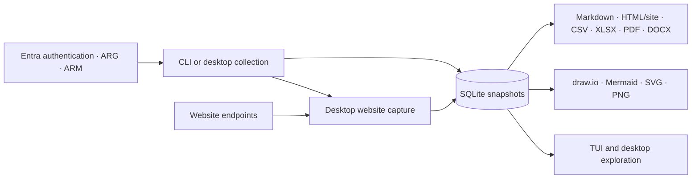

# azdocs documentation

azdocs collects accessible Azure configuration and service evidence into local
SQLite snapshots. The CLI, terminal browser and desktop share the same Rust
core; reports, diagrams and stored-evidence exploration work offline.

Connection tests, collection and screenshot capture/refresh need network access.
Reports and diagrams read saved evidence only; they do not contact Azure or
websites. Scope and permissions limit what can be collected.

## Guides

### [Usage](usage/README.md)

| Page | Covers |
|---|---|
| [Installation](usage/installation.md) | Homebrew, direct downloads, source builds and shell completions |
| [Configuration](usage/configuration.md) | Named tenants, shared defaults, native secrets, migration and environment references |
| [Permission diagnostics](usage/permissions.md) | Connection tests, RBAC verdicts and coverage limits |
| [Collecting](usage/collecting.md) | Running the query pack, scoping, throttling |
| [Reports](usage/reports.md) | Assessments, technical references, Markdown, HTML/site, CSV and XLSX |
| [Diagrams](usage/diagrams.md) | draw.io, Mermaid, SVG/PNG, scopes and workbooks |
| [The TUI](usage/tui.md) | Browsing snapshots interactively |
| [Desktop explorer](usage/desktop.md) | Tauri app, estate navigation, findings, topology |
| [Website screenshots](usage/website-screenshots.md) | Capture, refresh, saved evidence and offline exports |
| [Snapshots](usage/snapshots.md) | Listing, diffing, pruning |
| [Queries](usage/queries.md) | Ad-hoc KQL and custom query packs |
| [CI](usage/ci.md) | Running azdocs in pipelines |
| [Troubleshooting](usage/troubleshooting.md) | Common errors and limitations |

### [Development](development/README.md)

| Page | Covers |
|---|---|
| [Architecture](development/architecture.md) | Modules, data flow, design decisions |
| [Desktop map](development/desktop-relationships.md) | Map layout, multi-port routing, label layering and regression contract |
| [Website screenshot pipeline](development/website-screenshots.md) | Native capture, isolation and platform smoke tests |
| [Data model](development/data-model.md) | SQLite schema and migrations |
| [Azure display metadata](development/azure-metadata.md) | Friendly Azure values and the reproducible refresh workflow |
| [Testing](development/testing.md) | Test layers, fixtures, golden files |
| [Contributing](development/contributing.md) | Common tasks, style, crate gotchas |
| [Releasing](development/releasing.md) | CI and the release workflow |

### [Reference](reference/README.md)

| Page | Covers |
|---|---|
| [Query pack](reference/queries.md) | Built-in queries, findings and Rust-side audits |
| [Operational evidence](reference/operational-evidence.md) | Sources, retention, scope, coverage and interpretation |
| [Labels](reference/labels.md) | User wording, placeholders and partial overrides |
| [Themes](reference/themes.md) | Document theme files: palette expressions, type scale, layout strategies |
| [Diagram standards](reference/diagrams.md) | Detail levels, A4 page fractions, density rungs, connector routing |
| [Desktop design language](reference/design.md) | Desktop tokens, typography, Overview dashboard and evidence workspace rules |
| [Design sheet](reference/design.html) | Generated swatches, type scale and brand marks |

### [Release notes](releases/README.md)

Versioned notes for the CLI and desktop packages published through GitHub
Releases and Homebrew.

### [Marks](marks/README.md)

| Page | Covers |
|---|---|
| [Asset index](marks/README.md) | azdocs mark, icon, lockup and background SVGs |
| [Usage guide](marks/USAGE.md) | Clear space, sizing, colour, placement and export rules |
| [Prompts and design record](marks/PROMPTS.md) | Concept prompts, selected direction and redraw invariants |

## Project policies

- [Contributing](../CONTRIBUTING.md)
- [Security and private vulnerability reporting](../SECURITY.md)
- [MIT licence](../LICENSE)
- [Third-party notices](../THIRD_PARTY_NOTICES.md) and [licence material](licenses/README.md)
