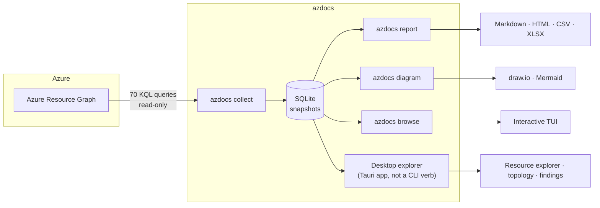

# azdocs documentation

azdocs audits an Azure estate with a read-only service principal, stores
point-in-time snapshots in SQLite, and exports reports and diagrams entirely
offline.

Everything right of the database works offline — reports and diagrams are
generated from the stored snapshot, never live Azure.

## Guides

### [Usage](usage/README.md)

| Page | Covers |
|---|---|
| [Installation](usage/installation.md) | Binaries, cargo install, shell completions |
| [Configuration](usage/configuration.md) | Service principal setup, config file, env vars |
| [Collecting](usage/collecting.md) | Running the query pack, scoping, throttling |
| [Reports](usage/reports.md) | Markdown, HTML, CSV, XLSX outputs |
| [Diagrams](usage/diagrams.md) | draw.io and Mermaid diagram types |
| [The TUI](usage/tui.md) | Browsing snapshots interactively |
| [Desktop explorer](usage/desktop.md) | Tauri app, estate navigation, findings, topology |
| [Snapshots](usage/snapshots.md) | Listing, diffing, pruning |
| [Queries](usage/queries.md) | Ad-hoc KQL and custom query packs |
| [CI](usage/ci.md) | Running azdocs in pipelines |
| [Troubleshooting](usage/troubleshooting.md) | Common errors and limitations |

### [Development](development/README.md)

| Page | Covers |
|---|---|
| [Architecture](development/architecture.md) | Modules, data flow, design decisions |
| [Desktop relationship maps](development/desktop-relationships.md) | Relationship layout, multi-port routing, label layering and regression contract |
| [Data model](development/data-model.md) | SQLite schema and migrations |
| [Azure display metadata](development/azure-metadata.md) | Friendly Azure values and the reproducible refresh workflow |
| [Testing](development/testing.md) | Test layers, fixtures, golden files |
| [Contributing](development/contributing.md) | Common tasks, style, crate gotchas |
| [Releasing](development/releasing.md) | CI and the release workflow |

### [Reference](reference/README.md)

| Page | Covers |
|---|---|
| [Query pack](reference/queries.md) | All 70 built-in queries and findings |
| [Themes](reference/themes.md) | Document theme files: palette expressions, type scale, layout strategies |
| [Diagram standards](reference/diagrams.md) | Detail levels, A4 page fractions, density rungs, connector routing |
| [Desktop design language](reference/design.md) | The "Field Report" tokens, type ramp and rules for the desktop app |
| [Design sheet](reference/design.html) | Generated swatches, type scale and brand marks |

### [Marks](marks/README.md)

| Page | Covers |
|---|---|
| [Asset index](marks/README.md) | azdocs mark, icon, lockup and background SVGs |
| [Usage guide](marks/USAGE.md) | Clear space, sizing, colour, placement and export rules |
| [Prompts and design record](marks/PROMPTS.md) | Concept prompts, selected direction and redraw invariants |
