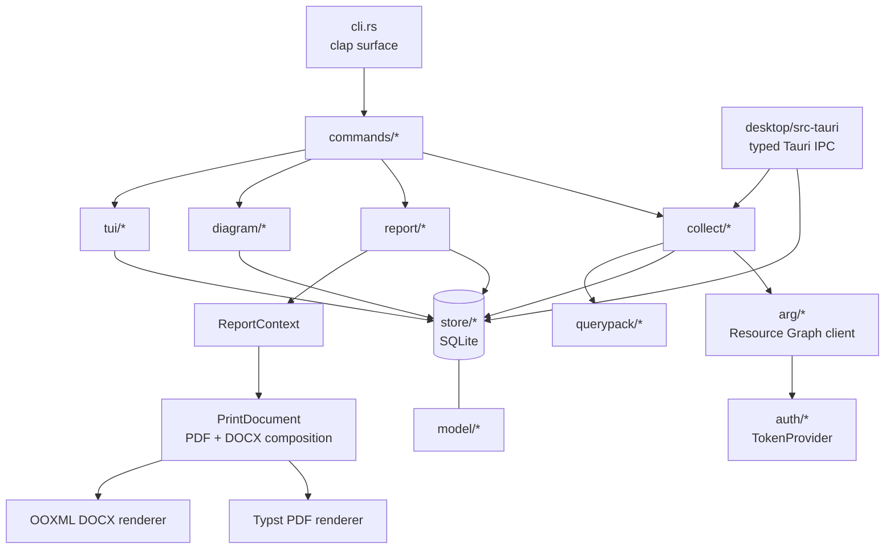
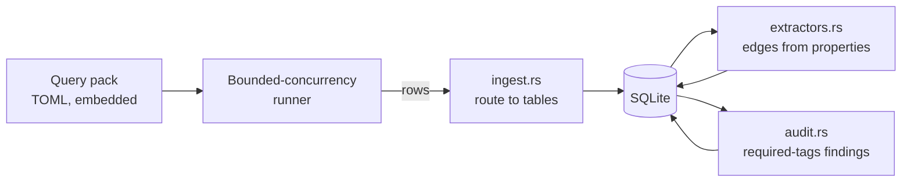

# Architecture

Single binary crate with a lib/bin split (`lib.rs` + thin `main.rs`) so
integration tests can call internals.

## Dependency flow

Strictly one-way:

The load-bearing rule: **report, diagram, and TUI code read only from SQLite,
never the network.** Everything after `collect` works offline — that's what
makes golden-file testing and air-gapped report generation possible.

## The collect pipeline

## Module map

| Path | Purpose |
|---|---|
| `src/cli.rs` | The whole clap surface — the contract for every command |
| `src/config.rs` | TOML config, platform paths, env overrides (`deny_unknown_fields`) |
| `src/auth/` | `TokenProvider` trait + OAuth2 client-credentials flow, cached single-flight refresh |
| `src/arg/` | ARG client: `$skipToken` pagination, 429 backoff, quota-header pacing |
| `src/querypack/` | `QueryDef` TOML model; built-ins embedded, user `queries.d/` merged by name |
| `src/store/` | All SQL. Versioned migrations, snapshot-scoped tables, cascade delete |
| `src/model/` | Plain data types + `azure_types.rs` display names |
| `src/collect/` | Runner, `ingest.rs`, `extractors.rs`, `audit.rs` |
| `src/report/` | `ReportContext` → all report data; `document.rs` composes one semantic `PrintDocument` for PDF + DOCX, while markdown / html / site / csv / xlsx consume `ReportContext` directly. Styled outputs use `BrandingContext`. |
| `src/diagram/` | `EstateGraph` builders (incl. per-VNet/per-RG fan-out) → `page` (A4 fractions, density rungs) → `layout` (measure/justify) → `route` (orthogonal connectors) → mermaid / drawio (single + workbook) / svg / png emitters |
| `src/tui/` | ratatui browse; `App` is a pure state machine, `ui.rs` renders it |
| `desktop/src-tauri/` | Thin Tauri v2 boundary; opens the shared `Store` per command and maps core models to serialisable DTOs. `topology.rs` builds the explorer's view-ready relationship graphs (estate lanes, group drill-in with folding, ×N aggregation and cross-group ghost stubs, bounded-depth neighbourhoods) with honest drawn/folded/aggregated counts |
| `desktop/src/` | React/TypeScript estate explorer and lazy-loaded Cytoscape.js relationship canvas; no direct file, database, credential, or Azure access |

## Design decisions

**ARM ids are lowercased at every join.** ARG returns inconsistent casing
across queries; every key id goes through `model::normalize_arm_id`, original
casing kept in `display_id`. Skipping this creates phantom duplicate
resources — the classic Azure inventory bug.

**Edges are derived in Rust, not queried.** `collect/extractors.rs` walks the
already-stored properties JSON: per-type handlers for the network/compute
chain (VNet → subnets/peerings, NIC → subnet/NSG/VM, private endpoint →
target, load balancer, application gateway, VMSS, AKS, App Service, storage
and key-vault network ACLs) plus two generic passes that apply to every
resource — child types link to the ARM parent their id nests under, and
`identity.userAssignedIdentities` links to the managed identity. Zero extra
API calls, retroactive on old snapshots, and each extractor is a pure
`fn(&Resource) -> Vec<Edge>`.

**Auth is ~80 hand-rolled lines on purpose.** The client-credentials flow is
one POST. `azure_identity` was rejected for API churn and unneeded surface.
The `TokenProvider` trait (static dispatch) keeps it swappable and testable.

**Queries are data, not code.** A new audit check is a TOML file. Routing in
`collect/ingest.rs`: the three core inventory queries fill typed tables, other
inventory rows land in `query_results` for report tables, finding rows become
`findings`.

**One graph, many emitters.** Diagram builders produce a single `EstateGraph`
(typed nodes with parent containment + styled edges); the Mermaid and draw.io
emitters both consume it. Report emitters share one `ReportContext`. The two
native print formats go one step further: `report/document.rs` turns that data,
branding and diagram bundle into an ordered `PrintDocument`, then the Typst and
OOXML backends render the same exhaustive block stream. Content, hierarchy,
labels, captions and asset placement therefore have one edit point; only
native layout mechanics remain renderer-specific.
