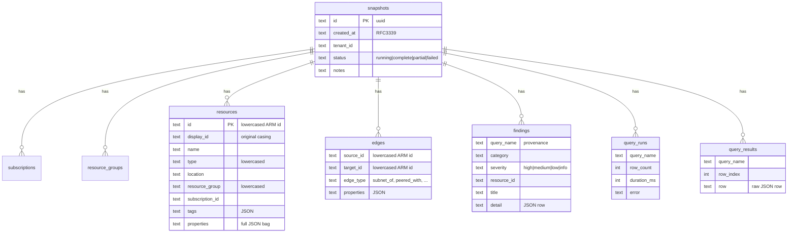

# Data model

One SQLite database (bundled — no system dependency), WAL mode, snapshot-scoped
rows with `ON DELETE CASCADE` from `snapshots`.

## Key points

- **Lowercased ids** are the join key everywhere (`resources.id`, edge
  endpoints, `findings.resource_id`); `display_id` keeps original casing for
  display. See [architecture](architecture.md#design-decisions) for why.
- **`query_results`** holds raw rows of the shaped inventory queries
  (mv-expanded subnets, peerings, …) verbatim — report category tables render
  straight from them.
- **`query_runs`** is the per-snapshot audit trail: which query ran, how many
  rows, how long, what failed.
- **Snapshot diff** is one `FULL OUTER JOIN` over `resources` between two
  snapshot ids (`store/snapshots.rs`): added / removed / changed (properties
  text differs).

## Migrations

Ordered SQL strings in `store/schema.rs`; `meta.schema_version` records how
many have run. **Append new migrations, never edit existing ones.** New tables
must cascade-delete from `snapshots`.
