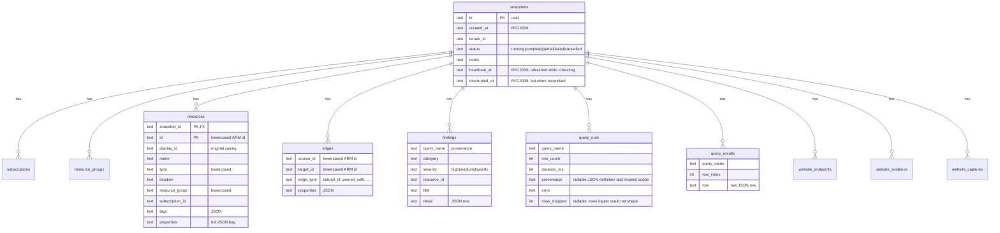

# Data model

One SQLite database (bundled — no system dependency), WAL mode, snapshot-scoped
rows with `ON DELETE CASCADE` from `snapshots`.



## Key points

- **Lowercased ids** are the join key everywhere (`resources.id`, edge
  endpoints, `findings.resource_id`); `display_id` keeps original casing for
  display. See [architecture](architecture.md#design-decisions) for why.
- **`query_results`** holds raw rows of the shaped inventory queries
  (mv-expanded subnets, peerings, …) verbatim — report category tables render
  straight from them.
- **`query_runs`** is the per-snapshot audit trail: which query ran, how many
  rows, how long, what failed. Migration 4 adds nullable `provenance` JSON with
  the executed KQL and its SHA-256, captured query metadata, source details,
  freshness rule and requested subscriptions/authorization scope. Failed runs
  retain provenance too. Older rows remain NULL, never backfilled from the
  current pack. Invalid stored metadata is reported as an error. Migration 5
  adds nullable `rows_dropped`: rows ARG returned that ingest could not shape
  into a typed table (no id, name, type or subscription). It is counted and
  logged, never silently skipped, so `row_count` never overstates what the
  store holds.
- **Snapshot liveness.** Migration 5 also adds `snapshots.heartbeat_at`,
  refreshed every 30 s by a running collect, and `interrupted_at`. Every
  writable open reconciles `running` rows whose heartbeat is older than ten
  minutes to `failed` and stamps `interrupted_at`, so a crash or Ctrl-C never
  leaves a permanent `running` row. A `cancelled` status records a collect
  stopped on request. Only `complete` and `partial` snapshots resolve as the
  implicit `latest` or as a diff baseline (`Store::previous_snapshot`).
- **Snapshot diff** is one `FULL OUTER JOIN` over `resources` between two
  snapshot ids (`store/snapshots.rs`): added / removed / changed (properties
  text differs).

Website tables were added by migration 3: `website_endpoints` stores ordered
endpoint associations as JSON, `website_evidence` stores management responses by
resource and evidence kind, and `website_captures` stores PNG bytes plus URL,
renderer, dimensions, successful capture fields and the latest attempt outcome.
Their keys include `snapshot_id`; shared URLs deduplicate within a snapshot.
See [Website screenshot pipeline](website-screenshots.md).

The diagram above summarises the core fields rather than listing every column.
Resource identity is the composite `(snapshot_id, id)`, so an ARM resource can
appear in many snapshots. `changed` compares the stored `properties` JSON text;
it does not currently report a tag-only, location-only or SKU-only change stored
outside that JSON as changed.

## Migrations

Ordered SQL strings in `store/schema.rs`; `meta.schema_version` records how
many have run. **Append new migrations, never edit existing ones.** New tables
must cascade-delete from `snapshots`.

## Open modes

`Store::open` is the writable path: it creates the file, runs pending
migrations, switches the journal to WAL and reconciles abandoned collects. Only
collect, prune, delete, verify, the desktop's start-up open and "Open
database" use it. Everything that merely reads (report, diagram, browse,
`snapshots list|show|diff`, every desktop explorer command) uses
`Store::open_read_only`, which never migrates, never creates a file and refuses
writes at the SQLite level. An archived baseline therefore stays byte-for-byte
the artefact that was archived, and a stray write in an offline path fails
instead of mutating history.

Both opens check the schema version. A database written by a newer azdocs is
refused with `SchemaTooNew` rather than opened with unknown tables; a read-only
open of an older database reports `MigrationRequired` and names the writable
commands that will migrate it. Every connection sets `foreign_keys=ON` and a
5 s `busy_timeout` so a desktop read waits out a CLI collect's write
transaction instead of failing.

Stored values this build cannot decode (a timestamp, status or severity it does
not know, malformed JSON) are errors naming the column, never a silent
fallback. The one exception is `edges.edge_type`: an unknown kind is skipped
with a warning because a newer azdocs may legitimately have stored one and the
schema version does not guard that vocabulary.

## The desktop wire contract

The Tauri frontend does not see these tables. It receives DTOs from
`desktop/src-tauri/src/dto.rs` and `topology.rs`, and their TypeScript
declarations are **generated**, not written by hand:

```sh
cargo test -p azdocs-desktop     # rewrites desktop/src/generated.ts
```

CI runs the same tests and then `git diff --exit-code`, so a struct change that
is not regenerated fails the build. Never edit `generated.ts`.

| File | Written by | Holds |
|---|---|---|
| `desktop/src/generated.ts` | ts-rs, via `src-tauri/src/bindings.rs` | Every DTO the IPC returns |
| `desktop/src/api-types.ts` | Hand | Closed string sets Rust serialises with `as_str()` — severity, edge kind, snapshot status — which ts-rs cannot infer. Referenced from the structs with `#[ts(type = "…")]` |
| `desktop/src/types.ts` | Hand | UI-only types, and the re-export surface everything imports |

Two serde behaviours this encodes, both of which had already produced bugs:

- `#[serde(rename_all)]` on an **enum** renames the variants. The fields of a
  struct variant need `rename_all_fields` — without it a payload goes out
  snake_case while every sibling field is camelCase.
- `Option<T>` serialises to `null`, not an absent key, so the generated type is
  `field?: T | null`.

## Shared database, tenant-scoped access

Tenant profiles do not add tables or rewrite historical snapshots. The existing
`snapshots.tenant_id` owns each estate; profile references and display names are
editable configuration, not historical keys. `Store::with_tenant` centralises
filtering for history, latest, ownership checks, previous comparisons and
pruning. Cross-tenant comparisons fail in Rust even for explicit snapshot IDs.
An unscoped mixed-tenant store requires selection for implicit history/latest
operations. `tenant_ids` enumerates stored tenants so deleted profiles remain
browsable. Profile removal never calls snapshot deletion.

Generated configuration DTOs contain `SettingsValues`, sparse overrides, tenant
summaries and connection diagnostics. Secret values are input-only command
parameters; legacy plaintext and native credential reads have no response DTO.
