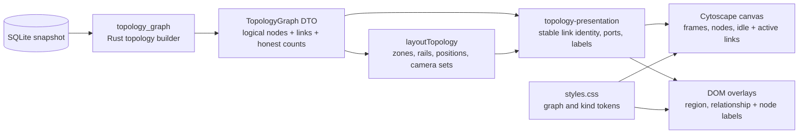
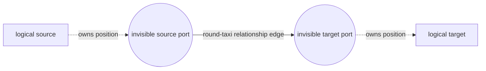

# Desktop relationship maps

This is the implementation contract for the desktop **Relationships**
workspace. It exists to prevent a visually plausible refactor from restoring
the defects already removed: clipped entry frames, centre-to-centre links,
shared connector trunks, crossed service routes, labels under lines, and
unconnected resources dominating the opening camera.

The visual language is defined in
[Desktop design language](../reference/design.md). The Rust topology builder
defines what the graph means. This page defines how that graph is laid out,
routed, painted, labelled, and tested in the desktop frontend.

## Ownership and data flow



The boundaries are deliberate:

- `desktop/src-tauri/src/topology.rs` owns graph semantics, folding,
  aggregation, external stubs, subscription collapse, filters, and counts.
  The webview must not recreate or reinterpret those rules.
- `desktop/src-tauri/src/groups.rs` owns resource-group membership: the join
  key, the synthetic group for a resource whose row is missing, and the name
  given to a group-less resource. It feeds both the topology builder and
  `EstateSnapshot.resourceGroupSummaries`. `topology-model.ts` implements the
  same rule for the browser preview only — importing it from a production
  component restores a second implementation that will drift, which is exactly
  what happened before.
- `desktop/src/components/topology-layout.ts` owns deterministic positions,
  zones, readable entry sets, and camera profiles. It has no rendering state.
- `desktop/src/components/topology-presentation.ts` owns stable connector
  identity, boundary-port assignment, taxi geometry, trace priority, and
  relationship-label placement. These remain pure functions.
- `desktop/src/components/CytoscapeResourceGraph.tsx` coordinates Cytoscape,
  the DOM overlays, interaction, animation, and resynchronisation. Synthetic
  render nodes never become application data.
- `desktop/src/styles.css` owns the cartographic field, stacking layers, and
  token remaps. Canvas colours are read from `--graph-*` and `--kind-*`
  tokens when the graph is built.

## Topology truth is not presentation

The DTO contains logical resource nodes and logical relationships. It keeps
the invariant:

```text
drawn + folded + aggregated == total
```

There is no visual node cap. A resource can be drawn, folded into its host or
ARM parent, or represented by an aggregate tile, but never silently omitted.
Filters account for anything they hide in `counts.hidden_by_filter`.

Containment is expressed by compound VNet/subnet frames and is never drawn as
a relationship connector. Cross-group neighbours remain dashed external
stubs. Unlinked resources belong to the unconnected shelf. Collapsed
subscriptions remain orientation bars with an explicit expand action.

Connector ports are a rendering device added after the DTO is received. They
must not affect counts, filters, keyboard order, selection, tracing, camera
targets, accessible summaries, or record navigation.

## Scope layouts and entry cameras

All ordering is stable: semantic position first, then name and normalised id
as the deterministic tie-breaker. Layout must not depend on object insertion
order, animation timing, or the current pointer position.

| Scope | Primary composition | Opening camera includes | Opening camera excludes |
|---|---|---|---|
| Estate | Expanded subscriptions as responsive resource-group grids; collapsed subscriptions on a side rail at wide widths and below at compact widths | Expanded lane frames and cards, plus every collapsed subscription bar | Nothing needed for subscription orientation |
| Resource group | VNet/subnet compounds as the network core; external context on a left boundary rail; free connected resources on a right service rail | Connected/contained resources and external neighbours | The unconnected shelf |
| Neighbourhood | Dominant subject in the centre; inbound one-hop peers left; outbound one-hop peers right; second hops in stable outer columns | Subject and one-hop peers | Second-hop context |

The opening camera starts wider than the computed final fit and settles
inward. Estate entry uses `0.88 ×` the final zoom; group and neighbourhood
entry use `0.80 ×`. Reduced motion applies the final camera immediately. **Fit
all** remains a separate explicit command and is the only default action that
may include every secondary region.

Camera collections contain logical graph nodes and logical connecting edges.
They explicitly exclude synthetic connector-port nodes. A resize may recompute
the layout and camera only until the user deliberately pans or zooms; the
renderer must not fight a user-adjusted viewport.

## Rails, containment, and route-friendly placement

Compound VNet and subnet frames reserve a real header area above their
children. Empty subnets retain a compact dashed body so the frame and its name
remain legible.

External nodes are placed on a left rail. Their desired vertical position is
the average of their connected core anchors, then packed with enough clearance
to prevent card overlap. Connected free resources form the right-hand service
rail. Up to six services use one vertical column; larger sets use no more than
two columns when width permits. Each service starts near the average vertical
position of its connected core peers and is then packed with a minimum step of
one resource-card height plus `40px`.

This connection-aware ordering is part of connector routing. Replacing it
with an alphabetical grid recreates long diagonals and routes through sibling
cards even if the edge style remains orthogonal.

The unconnected shelf starts well below the connected bounds and is marked as
secondary. It remains reachable through **Fit all** and direct selection, but
must not enlarge the initial group frame.

## Connector ports and taxi channels

Every rendered relationship expands into three Cytoscape elements:



The ports are invisible, non-interactive `2px` nodes positioned exactly on
the logical node or compound-frame boundary. The edge stores
`logicalSource` and `logicalTarget` separately from its synthetic Cytoscape
endpoints. Every interaction that reasons about a relationship uses the
logical ids.

Port assignment follows these rules:

1. Choose left/right when the dominant separation is horizontal; choose
   top/bottom when it is vertical. Source and target use facing sides.
2. Group incident endpoints by logical node **and boundary side**.
3. Sort each group by the opposite endpoint's position on that side's axis,
   then by stable edge id. This preserves the spatial order of the peers and
   keeps reciprocal links adjacent.
4. Project the opposite endpoint onto the real boundary, clamped to the
   middle `15–85%` so connectors clear rounded corners.
5. Pack projected ports with up to `14px` separation. When measured bounds are
   unavailable, distribute them deterministically across the same safe span.
6. Derive a stable taxi turn in the `30–70%` range and use a horizontal or
   vertical `round-taxi` route to match the dominant axis.

Ports and taxi turns are recomputed after initial layout, node drag, resize,
and any position change. More connection points reduce shared trunks and
crossings; they are not an excuse to add a general pathfinder or mutate the
Rust DTO.

## Paint order and labels

The stack is explicit:

```text
neutral cartographic field
  → Cytoscape frames and idle links
  → Cytoscape active-link underlay and active links
  → DOM region labels
  → DOM relationship labels
  → DOM node labels and controls
```

Cytoscape uses manual z-order. Idle links remain below nodes; traced links
rise above idle links but stay below the DOM label layers. Relationship text
must never be returned to Cytoscape edge labels: canvas paint order was the
cause of connectors appearing over text.

Relationship labels appear only for the active incident trace. They are
sentence case in Plex Sans on an opaque token-backed plate, positioned beside
the remote endpoint and away from the traced node. Parallel labels at the same
endpoint receive stable `24px` slots derived from sorted link identity. The
placer tries the preferred side, both perpendicular sides, and the opposite
side; it avoids node boxes and labels already placed in the frame, then clamps
the final fallback inside an `8px` safe area.

Region, relationship, and node overlays resynchronise through pan, zoom, drag,
resize, camera animation, and semantic zoom. Relationship plates remain above
all connector geometry for the entire transition, not only after it settles.

## Trace, motion, and accessibility

Exactly one trace source is resolved in this priority order:

1. keyboard focus;
2. pointer hover;
3. selected neighbourhood subject.

Incident routes gain their relationship-coloured underlay, full-opacity line,
directional dash, and arrow. Connected peers remain prominent. Unrelated
nodes and routes fade but do not disappear, preserving orientation and making
the effect usable without a second layout.

Directional dashes animate only when the window is visible, reduced motion is
not requested, the pause control is enabled, and an active route exists. The
DOM relationship plates are visual only. A separate polite live-region
summary announces the focused or selected node's inbound and outbound routes,
so accessible relationship evidence does not depend on canvas text.

Node labels form one roving Tab stop with spatial arrow-key movement. Click
and Enter perform the same primary action. **R** opens a focused resource's
neighbourhood. Synthetic ports never receive focus, pointer events, selection,
or an accessible name.

## Regression contract

The following are prohibited, even when a small fixture still looks tidy:

- connecting a relationship edge directly to the centre or default boundary
  of a logical node;
- sharing one synthetic port between unrelated incident links;
- ordering boundary ports only by edge id instead of peer position;
- replacing connection-aware rails with a name-only grid;
- routing a line through a sibling card or relying on card opacity to hide it;
- rendering relationship text with Cytoscape or placing a connector in a DOM
  label layer;
- using synthetic port ids for tracing, counts, camera fits, navigation, or
  accessibility;
- including the unconnected shelf or second-hop nodes in the opening camera;
- fitting all content on every entry, or starting tighter than the final fit;
- shrinking graph text below `11px`, hardcoding canvas colours, or creating a
  separate dark-mode composition;
- silently capping nodes, connectors, aggregate members, or collapsed lanes;
- deriving resource-group membership, or any other DTO semantics, in the
  webview — importing `topology-model.ts` from a production component is the
  concrete form of this, and it had already drifted from the Rust rule on
  synthetic group ids before it was caught.

## Tests and review

Pure-function tests are the first line of defence:

- `topology-layout.test.ts` covers estate lane orientation, external and
  service rails, shelf exclusion, directional neighbourhoods, camera target
  sets, wider-to-final entry motion, and 1440/1060/800px layouts.
- `topology-presentation.test.ts` covers deterministic taxi channels,
  dominant route axes, peer-position port ordering, projected compound-frame
  ports, reciprocal route pairing, boundary coordinates, drag-side changes,
  trace priority, label endpoint/side/slot selection, and obstacle avoidance.
- `topology-view-state.test.ts` covers graph state retained across loading,
  failure, retry, and scope changes.
- `topology-fallback.test.ts` reads the Rust sources and asserts the browser
  preview's `edgeKindClass` covers every `EdgeKind` with the same family. The
  mirror is not compiler-checked across the language boundary, and it had
  already drifted: `monitors` was classified as "structure".
- `navigation-state.test.ts` covers history-aware drill-down and the
  relationship workspace reducer.
- Rust topology tests continue to cover the representation equation, folding,
  aggregation, external stubs, filters, and large estates. These run in CI as
  `cargo test -p azdocs-desktop`.

Run the relationship UI tests and build from `desktop/`:

```sh
pnpm test
pnpm run build
```

Then visually check estate, group, and one-/two-hop neighbourhood scopes at
`1440×900`, the compact desktop breakpoint, and the narrow test width in both
themes. During pan, zoom, drag, resize, and entry animation verify that routes
stay separated, labels stay above links, the correct regions enter the frame,
and paused/reduced motion remains still. A screenshot taken only after the
camera settles is not sufficient evidence for the paint-order contract.
