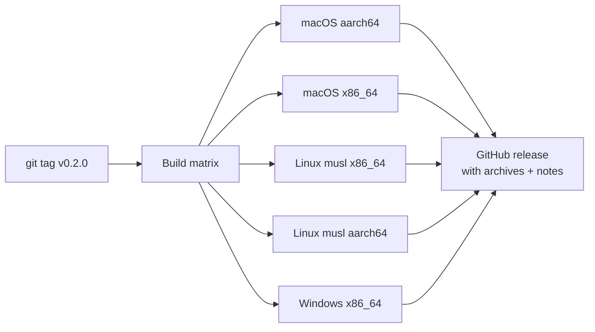

# Releasing

## CI

`.github/workflows/ci.yml` runs two jobs on every push and PR.

**`test`**, across ubuntu-latest, macos-latest and windows-latest:

- `cargo fmt --all --check` (covers both workspace members)
- `cargo clippy --all-targets --locked -- -D warnings`
- `cargo test --locked`

**`desktop`**, on ubuntu-latest, after installing the Tauri system libraries:

- `pnpm install --frozen-lockfile`, then `pnpm run lint`, `pnpm run typecheck`,
  `pnpm test` and `pnpm run build`
- `cargo clippy -p azdocs-desktop --all-targets --locked -- -D warnings`
- `cargo test -p azdocs-desktop --locked`

The frontend uses pnpm, not npm. Both jobs share one lockfile and one `target/`
now that `desktop/src-tauri` is a workspace member.

> Not yet covered: `pnpm run tauri build` is never exercised, so the packaged
> bundle is only compiled at release time, and the desktop job is Linux-only.

## Release builds

Tagging `v*` triggers `.github/workflows/release.yml`:



```sh
git tag v0.2.0
git push origin v0.2.0
```

The musl builds are fully static; every artifact is a single dependency-free
binary.
