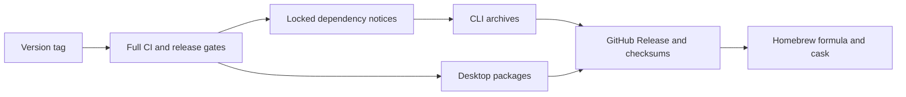

# Releasing

Pushing a version tag runs the complete release path: the normal CI suite,
metadata and credential gates, CLI archives, desktop packages, GitHub Release
publication, and the Homebrew tap update. A failed build cannot publish a
partial release.

## Release graph



`.github/workflows/ci.yml` is both the push/pull-request workflow and the
reusable CI gate called by `.github/workflows/release.yml`. The release job
does not rebuild a reduced test subset.

## Before tagging

1. Review the intended commit and a passing `main` CI run. Keep real
   configurations, databases, secrets and report output out of the repository
   and its history.
2. Keep the versions in `Cargo.toml`,
   `desktop/src-tauri/Cargo.toml`, `desktop/package.json` and
   `desktop/src-tauri/tauri.conf.json` aligned. Update `Cargo.lock` after a
   version change.
3. Add `docs/releases/<version>.md` and link it from
   `docs/releases/README.md`. The tag must be `v<version>`.
4. Review dependency and asset notices whenever dependencies, fonts, icons or
   adapted queries change.
5. Confirm that the repository is public. Homebrew clients cannot fetch release
   assets from a private GitHub repository.

The workflow enforces steps 2, 3 and 5 before it starts packaging.

## Required GitHub secrets

The repository needs these Actions secrets:

| Secret | Purpose |
|---|---|
| `APPLE_CERTIFICATE` | Base64-encoded Developer ID Application `.p12` |
| `APPLE_CERTIFICATE_PASSWORD` | Password used to export that certificate |
| `KEYCHAIN_PASSWORD` | Disposable CI keychain password |
| `APPLE_API_ISSUER` | App Store Connect API issuer UUID |
| `APPLE_API_KEY` | App Store Connect API key ID |
| `APPLE_API_PRIVATE_KEY` | Complete App Store Connect `AuthKey_*.p8` contents |
| `HOMEBREW_TAP_DEPLOY_KEY` | Dedicated SSH deploy key with write access only to `russmckendrick/homebrew-tap` |

The Apple certificate must be a **Developer ID Application** identity. An Apple
Distribution or Developer ID Installer certificate cannot sign the
direct-download app bundle. The workflow verifies the imported identity, signs
the macOS app and DMG, notarizes through App Store Connect, mounts the finished
DMG, and checks its signature, staple and Gatekeeper verdict.

Do not place certificates, private keys or token values in the repository,
workflow YAML, release notes or build artifacts.

## Published artifacts

The CLI archives use stable, user-facing names:

| Platform | Release asset |
|---|---|
| macOS Apple Silicon | `azdocs-darwin-arm64.tar.gz` |
| macOS Intel | `azdocs-darwin-amd64.tar.gz` |
| Linux x86-64 | `azdocs-linux-amd64.tar.gz` |
| Linux ARM64 | `azdocs-linux-arm64.tar.gz` |
| Windows x86-64 | `azdocs-windows-amd64.zip` |

Each archive contains the executable, MIT licence, project third-party notice,
generated locked Rust dependency report, font notice and retained Microsoft
licence material. Linux CLI archives use musl.

Desktop packages are:

| Platform | Release assets |
|---|---|
| macOS Apple Silicon | Signed and notarized `azdocs-desktop-macos-arm64.dmg` |
| Windows x86-64 | NSIS `setup.exe` and MSI installers |
| Linux x86-64 and ARM64 | AppImage, DEB and RPM packages |

The desktop bundle embeds the project licence and static asset/query notices.
Every artifact has a sibling `.sha256` file, and
`azdocs-checksums.sha256` consolidates all published hashes.

## Dependency notices

The release workflow uses cargo-about 0.9.2. Reproduce its report with:

```sh
cargo install cargo-about --version 0.9.2 --locked
cargo fetch --locked
mkdir -p output/licenses
cargo about generate --offline --locked --fail docs/licenses/about.hbs -o output/licenses/dependency-licenses.html
```

`about.toml` covers the five CLI targets, includes transitive and build
dependencies, and excludes development-only dependencies. Licence generation
fails when a dependency's licence cannot be determined or is not accepted.
The explicit asset notices cover IBM Plex, the fallback fonts in
`typst-assets`, Microsoft Azure artwork and adapted Microsoft queries.

## Publish

For version 0.1.0:

```sh
git tag -s v0.1.0 -m "azdocs v0.1.0"
git push origin v0.1.0
```

The release body comes from `docs/releases/0.1.0.md`. After GitHub publishes
all files, `.github/workflows/update-tap.yml` writes
`Formula/azdocs.rb` and `Casks/azdocs-desktop.rb` in
`russmckendrick/homebrew-tap`, validates their Ruby syntax, and pushes the tap
commit. The workflow can also be dispatched manually with an existing release
tag to repair or repeat only the tap update.

## Verify the published release

Treat the uploaded files, rather than local build output, as the release
candidate:

```sh
brew update
brew install russmckendrick/tap/azdocs
azdocs --version

brew install --cask russmckendrick/tap/azdocs-desktop
```

Also download the direct assets, verify them against
`azdocs-checksums.sha256`, and smoke-test the CLI plus the native installer on
each platform. On macOS, `spctl` must accept the installed app without a
quarantine override.
