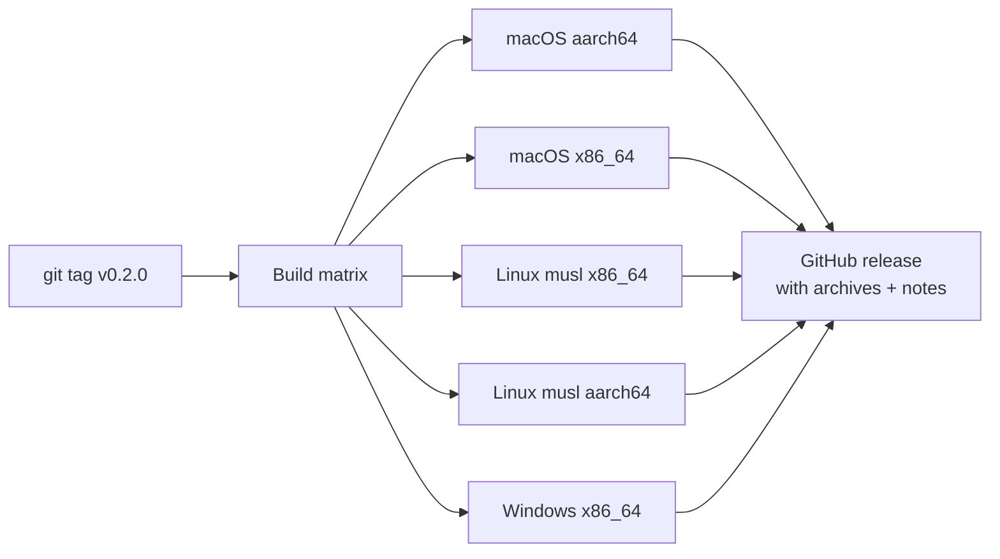

# Releasing

## CI

`.github/workflows/ci.yml` runs on every push and PR:

- `cargo fmt --check`
- `cargo clippy --all-targets --locked -- -D warnings`
- `cargo test --locked`

across ubuntu-latest, macos-latest, and windows-latest.

## Release builds

Tagging `v*` triggers `.github/workflows/release.yml`:



```sh
git tag v0.2.0
git push origin v0.2.0
```

The musl builds are fully static; every artifact is a single dependency-free
binary.
