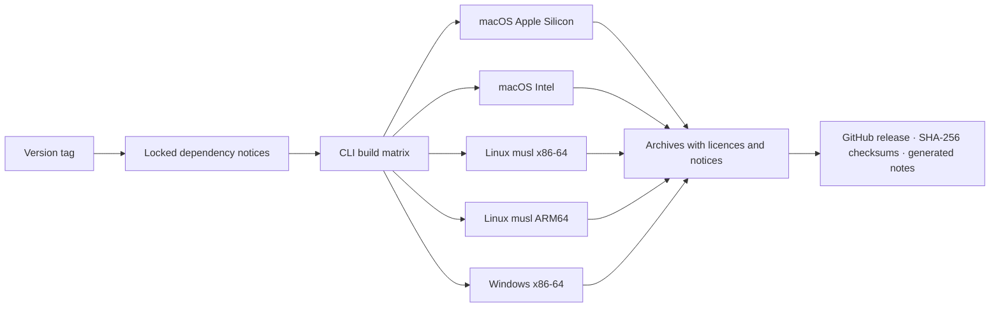

# Releasing

## CI coverage

`.github/workflows/ci.yml` runs on pushes to `main` and pull requests.

| Job | Platforms | Checks |
|---|---|---|
| Documentation | Linux | Local links and anchors, TOML examples, query catalogue, generated design sheet |
| CLI | Linux, macOS, Windows | Workspace formatting; root-package Clippy and tests; separate native credential-store smoke tests |
| Desktop | Linux, macOS, Windows | Frontend lint, typecheck, tests and production assets; backend Clippy/tests; generated wire-contract checks; native website-capture smoke test |

Linux installs the required system libraries and uses Xvfb for native capture.
Capture evidence is retained for seven days when artifact upload succeeds; an
upload failure warns, while a native smoke failure fails the job. See
[Testing](testing.md) and [Website screenshots](website-screenshots.md#verification).

CI builds frontend assets and exercises the desktop backend, but does not run
`pnpm run tauri build`. It therefore does not validate platform installers,
signing, notarisation or installation on a clean end-user machine.

## Before tagging

1. Review the intended commit and passing CI. Keep real configurations, databases,
   secrets and report output out of the repository and its history.
2. Keep the CLI and desktop Cargo versions, `desktop/package.json` and
   `desktop/src-tauri/tauri.conf.json` aligned. Update `Cargo.lock` after a version
   change and verify the tag matches the intended version.
3. Check the README, installation instructions and notices against what will
   actually be published. Remove the first-release/source-only wording when
   downloadable artifacts become available.
4. Regenerate dependency notices and review upstream licence changes when
   dependencies or bundled fonts/assets change. Preserve the asset notices in
   [Third-party notices](../../THIRD_PARTY_NOTICES.md).

## Dependency notices

The release workflow uses cargo-about 0.9.2. To reproduce its CLI report:

```sh
cargo install cargo-about --version 0.9.2 --locked
cargo fetch --locked
mkdir -p output/licenses
cargo about generate --offline --locked --fail docs/licenses/about.hbs -o output/licenses/dependency-licenses.html
```

`about.toml` covers the five CLI targets, includes transitive/build dependencies,
and excludes development-only dependencies. The template links each crate to
its published source archive. Licence generation fails when a dependency's
licence cannot be determined or accepted. This is a CLI dependency report;
shipping desktop bundles also requires their Rust and JavaScript notices.
The explicit asset notices cover IBM Plex, the fallback fonts in `typst-assets`,
Microsoft Azure artwork and adapted Microsoft queries.

## CLI release workflow

A pushed `v*` tag triggers `.github/workflows/release.yml`:



For the current 0.1.0 package versions, the release tag would be:

```sh
git tag v0.1.0
git push origin v0.1.0
```

These commands publish a release; run them only when that version is ready.
The workflow builds CLI executables, not desktop installers. Linux uses musl;
macOS and Windows use operating-system libraries. Archives include `LICENSE`,
`THIRD_PARTY_NOTICES.md`, the generated dependency report and referenced font/query
licence files. `azdocs-checksums.sha256` accompanies the archives.

After the workflow completes, download the actual artifacts, check their
checksums and run `azdocs --version` and an offline fixture export on the target
platforms. A local build or a successful source test does not establish that
all published archives run correctly.
