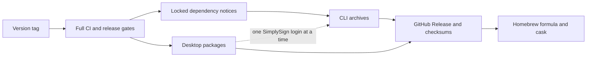
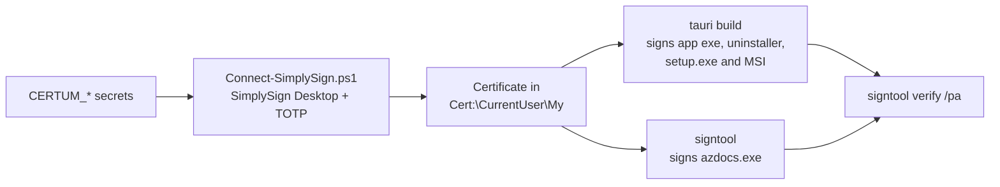

# Releasing

Pushing a version tag runs the complete release path: the normal CI suite,
metadata and credential gates, CLI archives, desktop packages, GitHub Release
publication, and the Homebrew tap update. A failed build cannot publish a
partial release.

## Release graph



`.github/workflows/ci.yml` is both the push/pull-request workflow and the
reusable CI gate called by `.github/workflows/release.yml`. The release job
does not rebuild a reduced test subset.

## Before tagging

1. Review the intended commit and a passing `main` CI run. Keep real
   configurations, databases, secrets and report output out of the repository
   and its history.
2. Keep the versions in `Cargo.toml`,
   `desktop/src-tauri/Cargo.toml`, `desktop/package.json` and
   `desktop/src-tauri/tauri.conf.json` aligned. Update `Cargo.lock` after a
   version change.
3. Cut the release notes (below) into `docs/releases/<version>.md` and link
   it from `docs/releases/README.md`. The tag must be `v<version>`.
4. Review dependency and asset notices whenever dependencies, fonts, icons or
   adapted queries change: `cargo deny check`, the cargo-about report and
   `desktop/THIRD_PARTY_LICENSES.md` (`pnpm run licenses`) all gate CI.
5. Confirm that the repository is public. Homebrew clients cannot fetch release
   assets from a private GitHub repository.

The workflow enforces steps 2, 3 and 5 before it starts packaging.

### Cut the release notes

`CHANGELOG.md` accumulates every user-visible change under **Unreleased** as
it lands. At release time:

1. Rename the Unreleased heading to the version and date, add a fresh empty
   Unreleased section above it, and update the comparison links at the foot.
2. Write `docs/releases/<version>.md` from that section: a one-line title,
   a paragraph of context, the highlights as a short list, and the standard
   install and upgrade block from the previous note.
3. Add the row to `docs/releases/README.md`.

The GitHub Release body is that file verbatim.

## Required GitHub secrets

The repository needs these Actions secrets:

| Secret | Purpose |
|---|---|
| `APPLE_CERTIFICATE` | Base64-encoded Developer ID Application `.p12` |
| `APPLE_CERTIFICATE_PASSWORD` | Password used to export that certificate |
| `KEYCHAIN_PASSWORD` | Disposable CI keychain password |
| `APPLE_API_ISSUER` | App Store Connect API issuer UUID |
| `APPLE_API_KEY` | App Store Connect API key ID |
| `APPLE_API_PRIVATE_KEY` | Complete App Store Connect `AuthKey_*.p8` contents |
| `HOMEBREW_TAP_DEPLOY_KEY` | Dedicated SSH deploy key with write access only to `russmckendrick/homebrew-tap` |

These are optional and turn on Windows code signing when all are set:

| Secret | Purpose |
|---|---|
| `CERTUM_USERNAME` | The Certum SimplySign account email |
| `CERTUM_OTP_URI` | The complete `otpauth://totp/...` URI behind the SimplySign mobile app's QR code. As sensitive as the signing key: with it and the account name anyone can sign as the project until the QR code is regenerated |
| `CERTUM_CERT_SHA1` | SHA-1 thumbprint of the Certum code-signing certificate, hex without colons (`openssl x509 -inform der -in <cert>.cer -noout -fingerprint -sha1`). Not secret |

The certificate is a Certum Open Source Code Signing certificate held in
Certum's cloud HSM. Azure Artifact Signing is not used because it only
validates individual developers in the United States and Canada.
`.github/scripts/Connect-SimplySign.ps1` installs a pinned SimplySign Desktop
on the runner, logs in with a TOTP code generated from the seed, and waits for
the certificate to appear in the user's certificate store; signtool then finds
it by thumbprint.



In the desktop job Tauri signs as it bundles (`bundle.windows` is merged into
the notices config), so the app executable and the NSIS uninstaller inside the
installers are signed as well as the installers themselves. The CLI's Windows
leg signs `azdocs.exe` before packaging. Both fail the release if a file they
signed does not verify.

A TOTP code is single-use, so two SimplySign logins must never overlap: the
later one reads "invalid user name or token", and repeated failures lock the
account. The desktop job and the manual check share the `certum-simplysign`
concurrency group, and the CLI matrix is ordered after the desktop job
(a concurrency group would cancel queued matrix legs). Do not rerun a failed
login repeatedly; check the account in SimplySign first.

To prove the secrets work without a release, run the **Windows signing check**
workflow (`.github/workflows/signing-check.yml`) by hand. It spends one login
and signs a throwaway executable.

Without the secrets the Windows jobs build unsigned binaries, say so in the
run summary, and Windows SmartScreen warns on first run; the
[installation guide](../usage/installation.md#windows-smartscreen) tells users
what to expect.

The Apple certificate must be a **Developer ID Application** identity. An Apple
Distribution or Developer ID Installer certificate cannot sign the
direct-download app bundle. The workflow verifies the imported identity, signs
the macOS app and DMG, notarizes through App Store Connect, mounts the finished
DMG, and checks its signature, staple and Gatekeeper verdict.

Do not place certificates, private keys or token values in the repository,
workflow YAML, release notes or build artifacts.

## Published artifacts

The CLI archives use stable, user-facing names:

| Platform | Release asset |
|---|---|
| macOS Apple Silicon | `azdocs-darwin-arm64.tar.gz` |
| macOS Intel | `azdocs-darwin-amd64.tar.gz` |
| Linux x86-64 | `azdocs-linux-amd64.tar.gz` |
| Linux ARM64 | `azdocs-linux-arm64.tar.gz` |
| Windows x86-64 | `azdocs-windows-amd64.zip` |

Each archive contains the executable, MIT licence, project third-party notice,
generated locked Rust dependency report, font notice and retained Microsoft
licence material. Linux CLI archives use musl.

Desktop packages are:

| Platform | Release assets |
|---|---|
| macOS Apple Silicon | Signed and notarized `azdocs-desktop-macos-arm64.dmg` |
| Windows x86-64 | NSIS `setup.exe` and MSI installers |
| Linux x86-64 and ARM64 | AppImage, DEB and RPM packages |

The desktop bundle embeds the project licence, the static asset/query
notices, the generated Rust dependency report and the frontend licence
report under `notices/`.
Every artifact has a sibling `.sha256` file, and
`azdocs-checksums.sha256` consolidates all published hashes.

## Supply chain

Every push runs, besides fmt, clippy and the test matrix:

| Gate | What it holds |
|---|---|
| `cargo deny check` (`deny.toml`) | RustSec vulnerabilities anywhere in the graph and unmaintained crates the workspace depends on directly (deeper ones are warnings), the licence allowlist shared with `about.toml`, no wildcard versions, crates.io only, and named bans (`azure_identity`, `openssl-sys`) |
| `pnpm audit --audit-level=high` | Frontend advisories |
| Licence notices | `cargo about generate --fail` and `node scripts/frontend-licenses.mjs --check` |
| Minimum supported Rust | `cargo check --workspace` on the `rust-version` floor (1.92) |
| musl | The CLI suite on the two Linux release targets, natively per architecture |
| Coverage | `cargo llvm-cov` lcov report as a run artifact |

Every action is pinned to a commit SHA with its tag in a comment; Dependabot
proposes the bumps weekly. Workflows run with read-only repository access;
only the publish job can write a release, and the packaging jobs hold the
OIDC token needed to attest.

Each CLI archive ships with an SPDX SBOM (`<archive>.spdx.json`) and every
archive and desktop package carries a build-provenance attestation, which a
downloader verifies with:

```sh
gh attestation verify azdocs-darwin-arm64.tar.gz --repo russmckendrick/azdocs
```

## Dependency notices

The release workflow uses cargo-about 0.9.2. Reproduce its report with:

```sh
cargo install cargo-about --version 0.9.2 --locked
cargo fetch --locked
mkdir -p output/licenses
cargo about generate --offline --locked --fail docs/licenses/about.hbs -o output/licenses/dependency-licenses.html
```

`about.toml` covers the five CLI targets, includes transitive and build
dependencies, and excludes development-only dependencies. Licence generation
fails when a dependency's licence cannot be determined or is not accepted.
The explicit asset notices cover IBM Plex, the fallback fonts in
`typst-assets`, Microsoft Azure artwork and adapted Microsoft queries.

## Publish

For a version `X.Y.Z`:

```sh
git tag -s vX.Y.Z -m "azdocs vX.Y.Z"
git push origin vX.Y.Z
```

The release body comes from `docs/releases/X.Y.Z.md`. After GitHub publishes
all files, `.github/workflows/update-tap.yml` writes
`Formula/azdocs.rb` and `Casks/azdocs-desktop.rb` in
`russmckendrick/homebrew-tap`, validates their Ruby syntax, and pushes the tap
commit. The workflow can also be dispatched manually with an existing release
tag to repair or repeat only the tap update.

## Verify the published release

Treat the uploaded files, rather than local build output, as the release
candidate:

```sh
brew update
brew install russmckendrick/tap/azdocs
azdocs --version

brew install --cask russmckendrick/tap/azdocs-desktop
```

Also download the direct assets, verify them against
`azdocs-checksums.sha256`, and smoke-test the CLI plus the native installer on
each platform. On macOS, `spctl` must accept the installed app without a
quarantine override.
