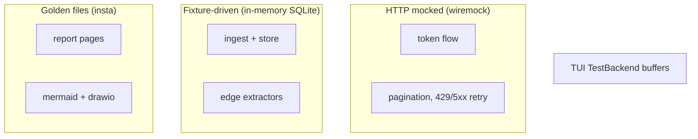

# Testing

```sh
cargo test                          # the CLI crate — no network required
cargo test --workspace              # CLI + desktop backend (what CI runs)
cargo test -p azdocs-desktop        # desktop topology, DTO and command helpers
cargo test --test collect_test      # one integration suite
cargo insta review                  # accept intended golden changes
INSTA_UPDATE=always cargo test      # regenerate all goldens (eyeball the diff!)
cd desktop && pnpm test             # relationship UI helpers and Rust↔TS mirrors
```

## Layers



| Layer | Approach | Where |
|---|---|---|
| HTTP (auth, ARG) | wiremock: token flow, `$skipToken` chains, 429/5xx | `tests/arg_client_test.rs` |
| Ingest/store | Fixture JSON → in-memory SQLite → assertions | `tests/collect_test.rs` |
| Edge extractors | Pure-function tests incl. adversarial inputs (nulls, mixed-case ids, cross-sub peerings) | `src/collect/extractors.rs` |
| Reports/diagrams | insta goldens from the fixture estate | `tests/report_golden_test.rs`, `tests/diagram_golden_test.rs` |
| draw.io XML | Structural re-parse: well-formed, unique ids, resolving refs | `tests/diagram_golden_test.rs` |
| Diagram geometry | Every canvas lands on a page fraction; every connector segment is axis-aligned; routes are deterministic | `src/diagram/svg.rs`, `src/diagram/route.rs`, `src/diagram/page.rs` |
| TUI | `TestBackend` buffer snapshots + key-event sequences | `tests/tui_test.rs` |
| Desktop topology | Pure-function tests over a synthetic 1,000-resource estate: drawn + folded + aggregated always equals total, deterministic output, fan-out folding, scope filters counted | `desktop/src-tauri/src/topology.rs` |
| Desktop relationship UI | Vitest at 1440/1060/800px: deterministic zones, rail alignment, directional neighbourhoods, camera targets, spatial navigation, per-edge boundary ports, taxi channels, label placement, trace priority, and retained-error state | `desktop/src/components/topology-layout.test.ts`, `desktop/src/components/topology-presentation.test.ts`, `desktop/src/components/topology-view-state.test.ts` |
| Rust↔TypeScript mirrors | Reads `src/model/mod.rs` and `topology.rs` and asserts the browser preview classifies every `EdgeKind` into the same family the Rust `match` does | `desktop/src/components/topology-fallback.test.ts` |
| Desktop navigation | History-aware drill-down and the relationship workspace reducer | `desktop/src/navigation-state.test.ts` |
| Wire contract | Regenerates `desktop/src/generated.ts` from the DTOs; CI then fails on `git diff` if it is stale. Also pins the serialised bytes of the event enums | `desktop/src-tauri/src/bindings.rs`, `dto.rs` |
| Display metadata | Asserts the Rust and TypeScript `humanize_identifier` agree on a shared case list — both are live, one renders the reports and one the desktop | `desktop/src/azure-values.test.ts`, `src/model/azure_values.rs` |

The full relationship rendering and screenshot review contract is in
[Desktop relationship maps](desktop-relationships.md#tests-and-review).

## The fixture estate

`tests/common/mod.rs` seeds the canonical estate every golden test renders:
two subscriptions, peered hub/spoke VNets, a VM with NIC + public IP, a
storage account with findings, a private endpoint → SQL server with a
database child, and a web app on its plan carrying a user-assigned identity.

**When you add a feature, extend the fixture so goldens exercise it**, then
regenerate and review:

```sh
INSTA_UPDATE=always cargo test
git diff tests/snapshots/    # the diff IS the review
```

## Rules for stable goldens

- Sort every output collection (by name, then id).
- Volatile values (snapshot uuids, timestamps) are normalised by insta filters
  in the test setup — extend the filters rather than embedding volatility.
