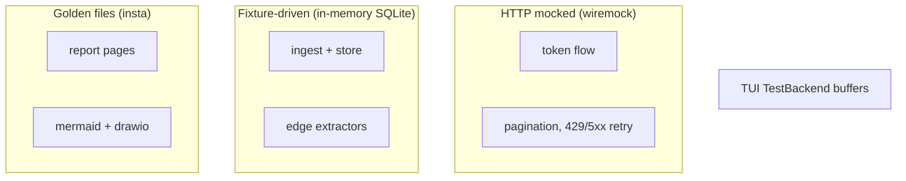

# Testing

```sh
cargo test                          # everything — no network required
cargo test --test collect_test     # one integration suite
cargo insta review                  # accept intended golden changes
INSTA_UPDATE=always cargo test      # regenerate all goldens (eyeball the diff!)
```

## Layers



| Layer | Approach | Where |
|---|---|---|
| HTTP (auth, ARG) | wiremock: token flow, `$skipToken` chains, 429/5xx | `tests/arg_client_test.rs` |
| Ingest/store | Fixture JSON → in-memory SQLite → assertions | `tests/collect_test.rs` |
| Edge extractors | Pure-function tests incl. adversarial inputs (nulls, mixed-case ids, cross-sub peerings) | `src/collect/extractors.rs` |
| Reports/diagrams | insta goldens from the fixture estate | `tests/report_golden_test.rs`, `tests/diagram_golden_test.rs` |
| draw.io XML | Structural re-parse: well-formed, unique ids, resolving refs | `tests/diagram_golden_test.rs` |
| TUI | `TestBackend` buffer snapshots + key-event sequences | `tests/tui_test.rs` |

## The fixture estate

`tests/common/mod.rs` seeds the canonical estate every golden test renders:
two subscriptions, peered hub/spoke VNets, a VM with NIC + public IP, a
storage account with findings, a private endpoint → SQL server.

**When you add a feature, extend the fixture so goldens exercise it**, then
regenerate and review:

```sh
INSTA_UPDATE=always cargo test
git diff tests/snapshots/    # the diff IS the review
```

## Rules for stable goldens

- Sort every output collection (by name, then id).
- Volatile values (snapshot uuids, timestamps) are normalised by insta filters
  in the test setup — extend the filters rather than embedding volatility.
