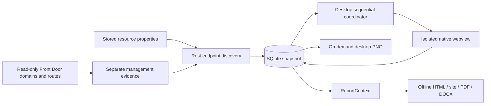

# Website screenshot pipeline



`src/collect/websites.rs` owns deterministic discovery and `WebsiteManagement`.
Pagination targets must remain on the management origin and within the requested
resource path before any bearer token is attached. HTTP redirects are disabled;
429/5xx retries are bounded. Management evidence lives outside ARG query runs.

Migration 3 appends snapshot-owned endpoint associations, management evidence and
URL-keyed capture records. SQL stays in `src/store/websites.rs`. Successful fields
and PNG bytes are updated together; failed attempts update only attempt fields.
Foreign keys cascade snapshot deletion. Startup marks abandoned running records
interrupted. `ReportContext::build_for_desktop` omits image blobs; the image command
loads a single PNG on demand. Normal report construction loads stored bytes once.

`desktop/src-tauri/src/capture/` owns the lease, deadline, readiness, isolation and
platform adapters. macOS uses `WKWebView.takeSnapshot`, Windows uses WebView2
`CapturePreview`, Linux uses WebKitGTK `get_snapshot`. Wry's macOS eval callback
queues depend on its original navigation delegate, so the restrictive capture
delegate uses native WebKit JavaScript evaluation. Each view has a unique label;
the coordinator waits for asynchronous Tauri destruction before advancing.
Capture uses Tauri's `unstable` child-webview API: a mapped 1440 × 900 child of
`main` is positioned outside the visible workspace, preserving viewport size
without a popup. Bounded JPEG previews travel through `WebsiteProgress`; the
React progress panel renders images rather than embedding remote scripts.
The main-window command guard rejects azdocs commands from capture views, and
Tauri capabilities remain restricted to `main`.

`src/report/websites.rs` supplies resource associations, galleries and raster
blocks. The shared `PrintDocument::reference` owns screenshot placement; PDF and
DOCX use the same block with column-sized proportional images. The assessment
path does not emit these blocks. Every export remains offline.

`src/report/metadata.rs` selects operational settings using
`data/reference_fields.toml` and emits shared `MetadataGroup` rows. Both native
renderers use a fixed one-third/two-thirds column grid and spanning section
headings. Website links use the same column
alignment and full, wrapping URLs after the resource's screenshot gallery.

## Verification

```sh
cargo test --workspace --locked
cargo clippy --workspace --all-targets --locked -- -D warnings
cargo fmt --all --check
cd desktop
pnpm run lint
pnpm run typecheck
pnpm test
```

In a graphical session on each supported desktop OS:

```sh
cargo run -p azdocs-desktop --locked --example website_capture_smoke
# Headless Linux CI uses a virtual display:
xvfb-run -a cargo run -p azdocs-desktop --locked --example website_capture_smoke
```

The local-only smoke example checks painted pixels, delayed assets, JavaScript,
redirect final URLs, HTTP error-page capture, clean cookies, deadlines, cancellation
child-view destruction, and the absence of capture popup windows. It writes PNGs and its disposable fixture database under
`output/website-smoke/`. CI runs the example on macOS, Windows and Linux and
uploads these artifacts with seven-day retention. Upload failures produce a visible
warning and job summary, while native smoke failures still fail CI. This lets the
generated-contract check run even when GitHub's artifact storage quota is full.
No Azure credentials are needed.

The Windows MSVC smoke executable embeds the Common Controls v6 manifest from
`desktop/src-tauri/examples/windows-app.manifest` through `build.rs`. Cargo examples
do not inherit the app executable's manifest; without it, the Windows loader can
exit with `STATUS_ENTRYPOINT_NOT_FOUND` before the smoke test starts.

For manual acceptance, check that keyboard focus remains in the original app,
exercise TLS/DNS failures and VPN sites, and verify preview/refresh/save/cancel
at 1440 × 900 and the minimum 980 × 680 window in both themes. Windows and Linux
native runtime acceptance must be performed on those hosts; a macOS build does
not establish it. `desktop/src/fixtures/website.png` is a WebKit capture of the
local smoke page, used only by the browser preview and stripped from native builds.
