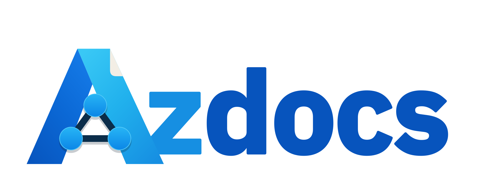
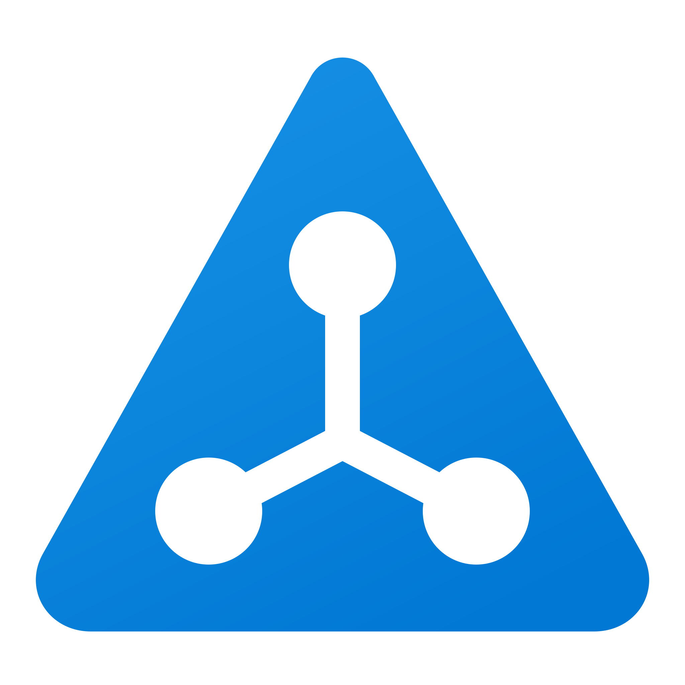
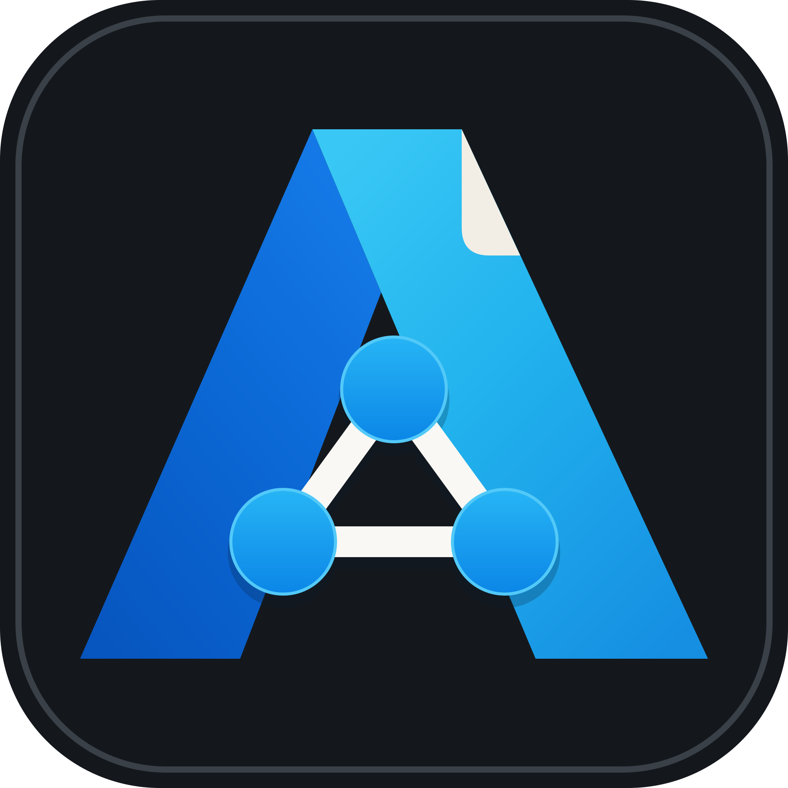
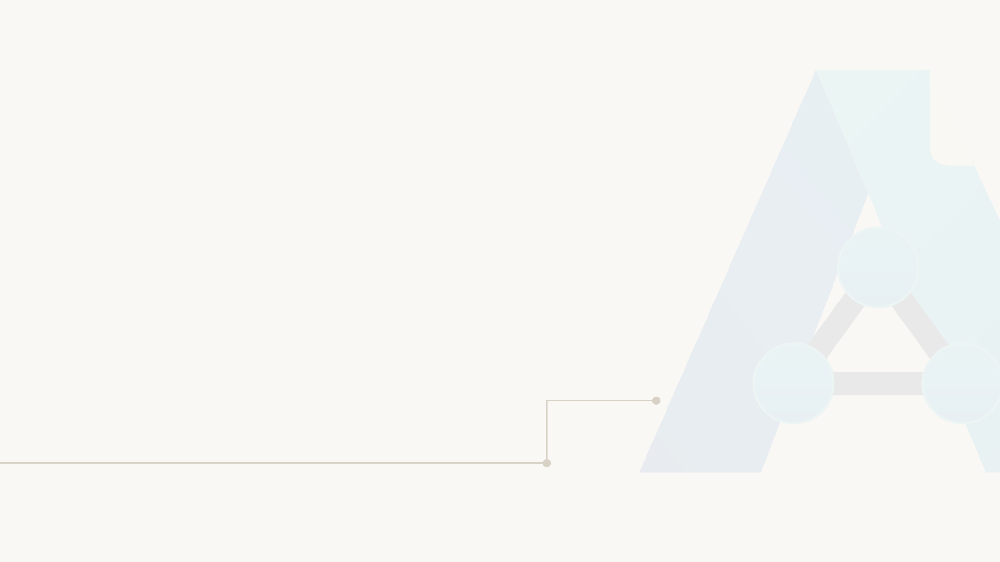

# azdocs marks

The azdocs identity is a rounded triangular **A** containing three connected
topology nodes. Its single blue silhouette and white internal diagram remain
clear at application-icon and favicon sizes. The result is an original azdocs
mark rather than a reproduction of the Microsoft Azure logo: the outer shape
suggests Azure estate work while the three-way graph carries the diagram idea.

<picture>
  <source media="(prefers-color-scheme: dark)" srcset="assets/azdocs-lockup-reversed.svg">
  
</picture>

## Asset index

All SVGs use exact paths and shapes only. The rounded triangle and symmetric
three-way graph are constructed geometry rather than an automatic raster trace.
The lockup wordmark is outlined from IBM Plex Sans Bold, so it has no runtime
font dependency.

| Asset | Intended use |
|---|---|
| [`azdocs-mark-primary.svg`](assets/azdocs-mark-primary.svg) | Default standalone mark on paper or other light surfaces |
| [`azdocs-mark-reversed.svg`](assets/azdocs-mark-reversed.svg) | Colour mark on dark surfaces |
| [`azdocs-mark-mono-ink.svg`](assets/azdocs-mark-mono-ink.svg) | One-colour print, embossing, engraving and restricted palettes |
| [`azdocs-mark-mono-paper.svg`](assets/azdocs-mark-mono-paper.svg) | One-colour reversed mark on dark surfaces |
| [`azdocs-app-icon-light.svg`](assets/azdocs-app-icon-light.svg) | Application icon for light launch surfaces |
| [`azdocs-app-icon-dark.svg`](assets/azdocs-app-icon-dark.svg) | Application icon for dark launch surfaces |
| [`azdocs-lockup-primary.svg`](assets/azdocs-lockup-primary.svg) | Default horizontal logo lockup |
| [`azdocs-lockup-reversed.svg`](assets/azdocs-lockup-reversed.svg) | Horizontal lockup on dark surfaces |
| [`azdocs-background-light.svg`](assets/azdocs-background-light.svg) | Light document, slide or site background motif |
| [`azdocs-background-dark.svg`](assets/azdocs-background-dark.svg) | Dark document, slide or site background motif |

Matching high-resolution PNGs live in [`png/`](png/): marks and app icons are
2048×2048, lockups are 2560×1024, and backgrounds are 3840×2160. SVG remains
the source format; the PNGs are deterministic raster exports of those vectors.

## App icons

<p>
  
  
</p>

## Background motif

<picture>
  <source media="(prefers-color-scheme: dark)" srcset="assets/azdocs-background-dark.svg">
  
</picture>

## Concept record

The reviewed raster boards are retained as design history, not production
artwork:

- [`azdocs-options.png`](concepts/azdocs-options.png) — the four-direction
  exploration.
- [`azdocs-selected-hybrid.png`](concepts/azdocs-selected-hybrid.png) — the
  earlier hybrid: Concept B's topology with Concept A's thick folded letter.
- [`azdocs-mark-master-source.png`](png/azdocs-mark-master-source.png) — the
  superseded folded-A refinement retained for design history. The current
  rounded triangular mark replaces its facets, fold and foreground graph with
  one simple silhouette and a white topology counter.

Use the SVGs for all final output. See the [usage guide](USAGE.md) for sizing,
colour and placement rules, and [prompts](PROMPTS.md) for the generation record
and regeneration constraints. [`manifest.json`](manifest.json) provides the
same asset inventory and palette in a machine-readable form.

The desktop masthead, browser favicons and Tauri packaging derive from these
production SVGs.

Rebuild the SVG sources, then regenerate their production PNG companions:

```sh
/opt/homebrew/Caskroom/miniconda/base/bin/python3 docs/marks/tools/build_vector_assets.py
AZDOCS_MARK_PREVIEW_DIR=docs/marks/png AZDOCS_MARK_PREVIEW_SCALE=1 \
  cargo test --test marks_assets_test
```

For a faster quarter-scale visual check, omit `AZDOCS_MARK_PREVIEW_SCALE` and
write to a temporary directory.
