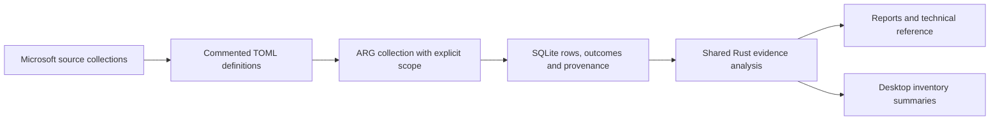

# Operational and access evidence

The built-in query pack collects accessible Microsoft service evidence through
Azure Resource Graph. Summaries, age checks and cross-dataset coverage are Rust
post-passes over SQLite; report export and desktop exploration remain offline.

## Microsoft sources and limits

| Evidence | Source | Interpretation |
| --- | --- | --- |
| Policy assignments, definitions, initiatives and evaluations | [Policy ARG samples](https://learn.microsoft.com/en-us/azure/governance/policy/samples/resource-graph-samples) | Assignment presence is separate from evaluation presence. No observed evaluation is not a passed control. |
| Role assignments and definitions | [RBAC ARG samples](https://learn.microsoft.com/en-us/azure/governance/resource-graph/samples/samples-by-category#azure-rbac), [privileged role IDs](https://learn.microsoft.com/en-us/azure/role-based-access-control/built-in-roles/privileged) | Preserve principal IDs, scope, conditions and complete permission blocks. No group expansion, identity resolution or PIM eligibility is inferred. Broad-role findings identify the three specified built-in roles; they do not detect every custom privileged role. |
| Patch assessments and installations | [Update Manager schema](https://learn.microsoft.com/en-us/azure/update-manager/query-logs), [sample queries](https://learn.microsoft.com/en-us/azure/update-manager/sample-query-logs) | Assessment history is seven days; installation history is 30 days. Summary jobs and per-patch records must not be counted together. |
| Guest configuration | [Machine Configuration reporting](https://learn.microsoft.com/en-us/azure/governance/machine-configuration/how-to/view-compliance), [assignment schema](https://learn.microsoft.com/en-us/rest/api/guestconfiguration/guest-configuration-assignments/get) | Preserve Pending, NonCompliant and unknown evidence. The provider's latest report is retained when exposed by ARG. |
| Backup protection, policies and jobs | [Backup ARG guide](https://learn.microsoft.com/en-us/azure/backup/query-backups-using-azure-resource-graph) | Jobs are available for up to 14 days. Protected-item presence, protection state, last backup time and last recovery point are distinct observations. |
| Vault protection settings | [Recovery Services schema](https://learn.microsoft.com/en-us/rest/api/recoveryservices/vaults/get), [Data Protection schema](https://learn.microsoft.com/en-us/rest/api/dataprotection/backup-vaults/get), [protection guidance](https://learn.microsoft.com/en-us/azure/backup/azure-backup-data-protection-best-practices) | The two vault types expose different settings. Missing fields do not mean disabled security controls. Security settings are inventory evidence; no irreversible vault change is performed. |
| Defender recommendations, detailed occurrences, active alerts and secure-score controls | [Defender ARG samples](https://learn.microsoft.com/en-us/azure/defender-for-cloud/resource-graph-samples) | Keep parent assessment IDs and multi-resource alert identifiers. Counts can overlap with regulatory controls; score percentages are not averaged into estate compliance. |
| Resource and Service Health | [Resource health samples](https://learn.microsoft.com/en-us/azure/governance/resource-graph/samples/samples-by-category#resource-health), [Service Health samples](https://learn.microsoft.com/en-us/azure/service-health/resource-graph-samples) | Observed availability is not uptime. Subscription-independent emerging issues are outside the Service Health ARG dataset. |
| ARM changes | [Change queries](https://learn.microsoft.com/en-us/azure/governance/resource-graph/changes/get-resource-changes), [retention and coverage](https://learn.microsoft.com/en-us/azure/governance/resource-graph/changes/resource-graph-changes) | Changes are queryable for 14 days. Actor/client information is retained when supplied; this is not a complete activity or data-plane log. |
| Remaining network cost observations | [FinOps query files](https://github.com/microsoft/finops-toolkit/tree/dev/src/templates/finops-hub/modules/Microsoft.FinOpsHubs/Recommendations/queries) | DDoS associations, provider provisioning and gateway connections are configuration observations, not measured utilisation or guaranteed savings. The gateway adaptation excludes configured point-to-site pools and joins full normalized IDs. |

## Scope and provenance

Assignment queries explicitly request `AtScopeAboveAndBelow`. Microsoft's
[authorization scope options](https://learn.microsoft.com/en-us/azure/governance/resource-graph/concepts/query-language#query-scope)
otherwise default to the requested scope and its descendants, excluding parent
assignments. The option is retained on every page and is supported by both named
queries and TOML files. It cannot overcome missing RBAC access.

Migration 4 records the executed KQL and its SHA-256, category, description, kind, severity, title/target-ID
fields, source URLs/revision/review date, age rule, normalized requested
subscriptions and authorization scope. An empty subscription list means all
subscriptions visible to the credential; it does not claim tenant-wide access.
Source review dates are not upstream version identifiers. Failures preserve the
attempted query metadata. Older snapshots retain unknown provenance.

Each export with provenance includes `query-provenance.json`. Human-readable
metadata also appears in HTML, Markdown/site, XLSX and the optional print
technical reference. Desktop inventory prefers the recorded description/kind
over today's query pack and shows the saved KQL and source details.

## Evidence age and coverage

Age is frozen at the snapshot instant. The default review thresholds are
72 hours for patch/guest assessments and 48 hours for backup recovery points.
These are azdocs review defaults, not Microsoft retention promises or universal
workload requirements. Change them through a complete user query override;
[query customisation](../usage/queries.md#source-metadata-inherited-scope-and-age-checks)
describes the fields.

The age summary separates records within the threshold, older records, missing
or invalid dates, and timestamps after collection. Failed/incomplete queries do
not generate age conclusions. A weekly backup policy can intentionally produce
an older recovery point, so the threshold is not a backup-failure finding.

Policy coverage matches full assignment IDs to stored state records. Patch
coverage compares assessments with the collected Azure VM/Arc inventory and
requires a successful, matching base-inventory row count before presenting that
denominator. Missing assessments can reflect service configuration, permissions,
retention or indexing delay. Neither coverage table promotes absence to success.

## Extending the implementation

- Queries and source/age metadata live in `queries/<category>/*.toml`.
- `model/evidence.rs` defines the persisted metadata; `querypack` validates it.
- `arg/client.rs` carries authorization scope across pagination.
- `collect/mod.rs` records metadata for successful and failed runs.
- `report/posture/operational.rs` owns grouping, normalized joins and age checks.
- `report/provenance.rs` renders recorded metadata without loading current definitions.
- Desktop DTOs are regenerated by `cargo test -p azdocs-desktop`; the frontend
  renders Rust's labelled summary cells and performs no compliance arithmetic.

Keep query comments beside the relevant projection, filter or join. Explain
provider differences, reductions and unknown-state handling, and cite the
Microsoft source whenever those semantics depend on an upstream contract.
