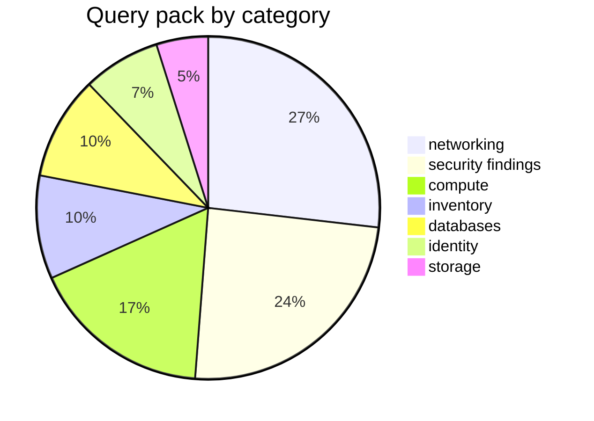

# Built-in query pack

41 queries ship embedded in the binary from `queries/`. List the live set
(including your custom queries) with `azdocs query list`, print KQL with
`azdocs query show <name>`, run one ad-hoc with `azdocs query run <name>`.
Override or extend via `queries.d/` — see
[usage/queries.md](../usage/queries.md#custom-queries).

## Inventory queries

| Name | Category | Description |
|---|---|---|
| `all_resources` | inventory | Every resource with its full properties bag — populates the resources table |
| `subscriptions` | inventory | All subscriptions visible to the credential |
| `resource_groups` | inventory | All resource groups |
| `resource_type_counts` | inventory | Resource counts by type |
| `virtual_networks` | networking | VNets with address spaces and DNS settings |
| `subnets` | networking | Subnets expanded from every VNet |
| `vnet_peerings` | networking | Peerings with state and remote network |
| `network_security_groups` | networking | NSGs with rule and attachment counts |
| `public_ip_addresses` | networking | Public IPs and what they're attached to |
| `load_balancers` | networking | Load balancers with SKU and rule counts |
| `app_gateways` | networking | App gateways with SKU, WAF state, listeners |
| `firewalls` | networking | Azure Firewalls with SKU and policy |
| `private_endpoints` | networking | Private endpoints and their targets |
| `private_dns_zones` | networking | Private DNS zones with record/link counts |
| `vpn_er_gateways` | networking | VPN/ExpressRoute gateways and circuits |
| `virtual_machines` | compute | VMs with size, OS, and power state |
| `vm_scale_sets` | compute | Scale sets with capacity and orchestration mode |
| `managed_disks` | compute | Disks with size, SKU, encryption, attachment |
| `aks_clusters` | compute | AKS with version, node pools, network plugin |
| `app_service_plans` | compute | Plans with SKU and app counts |
| `web_apps` | compute | App Services / Function Apps with TLS settings |
| `container_apps` | compute | Container Apps and environments |
| `storage_accounts` | storage | Storage accounts with SKU and network rules |
| `recovery_vaults` | storage | Recovery Services and Backup vaults |
| `sql_servers_and_dbs` | databases | SQL servers/dbs with public network access |
| `cosmos_accounts` | databases | Cosmos accounts with API kind and consistency |
| `postgres_mysql_flexible` | databases | PostgreSQL/MySQL flexible servers |
| `redis_caches` | databases | Redis with SKU and TLS settings |
| `key_vaults` | identity | Key vaults with protection and network settings |
| `managed_identities` | identity | User-assigned managed identities |
| `resources_with_system_identity` | identity | Resources with system-assigned identity |

## Security findings

| Name | Severity | Description |
|---|---|---|
| `nsg_open_to_internet` | 🔴 high | NSG rules allowing inbound from the Internet |
| `storage_public_blob_access` | 🔴 high | Anonymous public blob access enabled |
| `sql_public_network_access` | 🔴 high | Database servers reachable from public networks |
| `public_ip_exposed_resources` | 🔴 high | Public IPs directly on NICs |
| `storage_http_allowed` | 🟠 medium | Plain HTTP accepted by storage accounts |
| `disks_unencrypted_or_pmk` | 🟠 medium | Disks with platform-managed keys only |
| `keyvault_no_purge_protection` | 🟠 medium | Key vaults without purge protection |
| `keyvault_public_access` | 🟠 medium | Key vaults reachable from all networks |
| `vms_without_managed_disks` | 🟡 low | VMs on unmanaged (blob) OS disks |
| `orphaned_resources` | 🔵 info | Unattached disks, unused public IPs, orphaned NICs |

## Rust-side audits (not KQL)

Run as post-passes during `collect` because they need configuration or
cross-resource context a single query can't see:

| Name | Severity | Source |
|---|---|---|
| `missing_required_tags` | 🟡 low | `collect/audit.rs`, driven by `[audit] required_tags` |

Relationship **edges** (subnets, peerings, NSG associations, NIC/VM/disk
attachment, private endpoints, DNS links) are likewise derived in Rust
(`collect/extractors.rs`) rather than queried — see
[development/architecture.md](../development/architecture.md#design-decisions).
