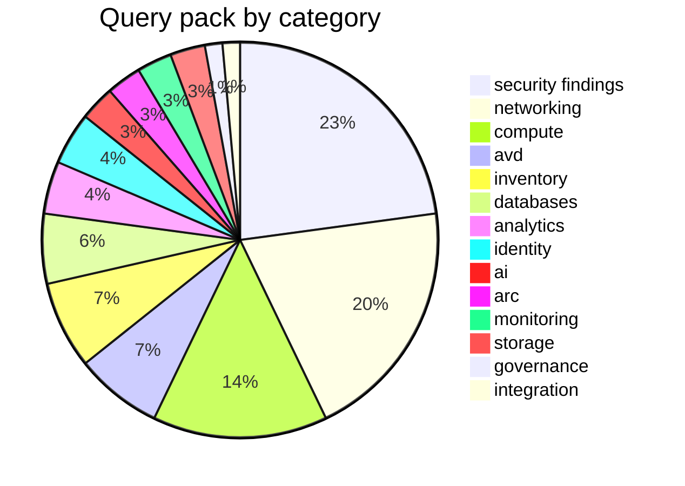

# Built-in query pack

70 queries ship embedded in the binary from `queries/`. List the live set
(including your custom queries) with `azdocs query list`, print KQL with
`azdocs query show <name>`, run one ad-hoc with `azdocs query run <name>`.
Override or extend via `queries.d/` — see
[usage/queries.md](../usage/queries.md#custom-queries).

## Inventory queries

| Name | Category | Description |
|---|---|---|
| `all_resources` | inventory | Every resource with its full properties bag — populates the resources table |
| `subscriptions` | inventory | All subscriptions visible to the credential |
| `resource_groups` | inventory | All resource groups |
| `resource_type_counts` | inventory | Resource counts by type |
| `tag_usage` | inventory | Tag keys in use across the estate with tagged resource counts |
| `virtual_networks` | networking | VNets with address spaces and DNS settings |
| `subnets` | networking | Subnets expanded from every VNet |
| `vnet_peerings` | networking | Peerings with state and remote network |
| `network_security_groups` | networking | NSGs with rule and attachment counts |
| `nsg_rules` | networking | Custom NSG security rules with direction, priority, and address/port scopes |
| `public_ip_addresses` | networking | Public IPs and what they're attached to |
| `load_balancers` | networking | Load balancers with SKU and rule counts |
| `app_gateways` | networking | App gateways with SKU, WAF mode/ruleset, and listener/pool counts |
| `firewalls` | networking | Azure Firewalls with SKU and policy |
| `bastion_hosts` | networking | Bastion hosts with SKU, VNet placement, and public IP |
| `private_endpoints` | networking | Private endpoints and their targets |
| `private_dns_zones` | networking | Private DNS zones with record/link counts |
| `private_dns_vnet_links` | networking | Private DNS zone virtual network links with registration status |
| `vpn_er_gateways` | networking | VPN/ExpressRoute gateways and circuits |
| `virtual_machines` | compute | VMs with size, OS, and power state |
| `vm_extensions` | compute | VM extensions with publisher, type, and owning virtual machine |
| `vm_network_config` | compute | VMs with their primary NIC, private/public IPs, and subnet |
| `vm_scale_sets` | compute | Scale sets with capacity, orchestration mode, and AKS ownership |
| `managed_disks` | compute | Disks with size, SKU, encryption, attachment |
| `aks_clusters` | compute | AKS with version, node pools, network plugin, RBAC and Defender posture |
| `app_service_plans` | compute | Plans with SKU and app counts |
| `web_apps` | compute | App Services / Function Apps with TLS, FTPS, and network settings |
| `static_web_apps` | compute | Static Web Apps with hostname, source repository, and network access |
| `container_apps` | compute | Container Apps and environments |
| `storage_accounts` | storage | Storage accounts with SKU, TLS floor, and network rules |
| `recovery_vaults` | storage | Recovery Services and Backup vaults |
| `sql_servers_and_dbs` | databases | SQL servers/dbs with public network access and Entra auth posture |
| `cosmos_accounts` | databases | Cosmos accounts with API kind and consistency |
| `postgres_mysql_flexible` | databases | PostgreSQL/MySQL flexible servers with HA and backup posture |
| `redis_caches` | databases | Redis with SKU and TLS settings |
| `key_vaults` | identity | Key vaults with protection and network settings |
| `managed_identities` | identity | User-assigned managed identities |
| `resources_with_system_identity` | identity | Resources with system-assigned identity |
| `cognitive_services` | ai | Cognitive Services and Azure OpenAI accounts with network and auth posture |
| `ai_search_services` | ai | Azure AI Search services with SKU, replicas, partitions, and network posture |
| `data_factories` | analytics | Data Factory instances with Git integration and network access |
| `synapse_workspaces` | analytics | Synapse workspaces with managed VNet and network access settings |
| `synapse_spark_pools` | analytics | Synapse Spark pools with node size, autoscale, and auto-pause configuration |
| `arc_machines` | arc | Azure Arc-enabled servers with OS, agent, and connectivity status |
| `arc_machine_extensions` | arc | Extensions installed on Azure Arc-enabled servers |
| `avd_host_pools` | avd | Azure Virtual Desktop host pools with type, load balancing, and session limits |
| `avd_workspaces` | avd | Azure Virtual Desktop workspaces with application group counts |
| `avd_application_groups` | avd | Azure Virtual Desktop application groups with their host pool |
| `avd_scaling_plans` | avd | Azure Virtual Desktop scaling plans with schedule and host pool counts |
| `avd_session_hosts` | avd | Likely AVD session hosts: VMs sharing a resource group with a host pool |
| `management_groups` | governance | Management group hierarchy (may return no rows when ARG access is scoped to subscriptions only) |
| `logic_app_workflows` | integration | Logic App workflows with state, identity, and integration account |
| `log_analytics_workspaces` | monitoring | Log Analytics workspaces with SKU, retention, quota, and network access |
| `app_insights_components` | monitoring | Application Insights components with retention, sampling, and workspace integration |

## Security findings

| Name | Severity | Description |
|---|---|---|
| `nsg_open_to_internet` | 🔴 high | NSG rules allowing inbound from the Internet |
| `storage_public_blob_access` | 🔴 high | Anonymous public blob access enabled |
| `sql_public_network_access` | 🔴 high | Database servers reachable from public networks |
| `public_ip_exposed_resources` | 🔴 high | Public IPs directly on NICs |
| `aks_rbac_disabled` | 🔴 high | AKS clusters with Kubernetes RBAC disabled |
| `storage_http_allowed` | 🟠 medium | Plain HTTP accepted by storage accounts |
| `storage_weak_tls` | 🟠 medium | Storage accounts permitting TLS versions below 1.2 |
| `disks_unencrypted_or_pmk` | 🟠 medium | Disks with platform-managed keys only |
| `keyvault_no_purge_protection` | 🟠 medium | Key vaults without purge protection |
| `keyvault_public_access` | 🟠 medium | Key vaults reachable from all networks |
| `web_app_https_only_disabled` | 🟠 medium | App Services not enforcing HTTPS-only traffic |
| `web_app_weak_tls_or_ftps` | 🟠 medium | App Services allowing weak TLS versions or unencrypted FTP |
| `vms_without_managed_disks` | 🟡 low | VMs on unmanaged (blob) OS disks |
| `aks_public_api_server` | 🟡 low | AKS clusters exposing a public API server with no authorized IP ranges |
| `orphaned_resources` | 🔵 info | Unattached disks, unused public IPs, orphaned NICs |
| `unassociated_nsgs` | 🔵 info | NSGs not associated with any subnet or network interface |

## Rust-side audits (not KQL)

Run as post-passes during `collect` because they need configuration or
cross-resource context a single query can't see:

| Name | Severity | Source |
|---|---|---|
| `missing_required_tags` | 🟡 low | `collect/audit.rs`, driven by `[audit] required_tags` |

Relationship **edges** (subnets, peerings, NSG associations, NIC/VM/disk
attachment, private endpoints, DNS links) are likewise derived in Rust
(`collect/extractors.rs`) rather than queried — see
[development/architecture.md](../development/architecture.md#design-decisions).

## Display names

Resource types render with friendly names (e.g. `microsoft.desktopvirtualization/hostpools`
→ "AVD Host Pool") from `data/display_names.toml`, embedded in the binary
(the built-in file; user overrides are separate — see below).
Add or override names without recompiling by creating
`<config dir>/azdocs/display_names.toml` with the same
`"<lowercase arm type>" = "Name"` shape — entries merge over the built-ins,
the same way `queries.d/` overrides queries.
