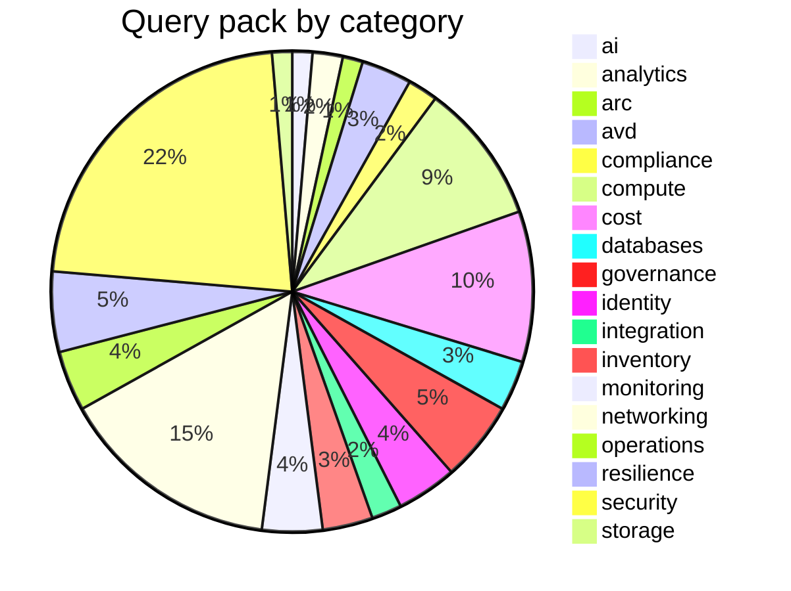

# Built-in query pack

148 queries ship embedded in the binary from `queries/`. List the live set
(including your custom queries) with `azdocs query list`, print KQL with
`azdocs query show <name>`, run one ad-hoc with `azdocs query run <name>`.
Override or extend via `queries.d/` — see
[usage/queries.md](../usage/queries.md#custom-queries).

## Inventory queries

| Name | Category | Description |
|---|---|---|
| `all_resources` | inventory | Every resource with its full properties bag — populates the resources table |
| `subscriptions` | inventory | All subscriptions visible to the credential |
| `resource_groups` | inventory | All resource groups |
| `resource_type_counts` | inventory | Resource counts by type |
| `tag_usage` | inventory | Tag keys in use across the estate with tagged resource counts |
| `virtual_networks` | networking | VNets with address spaces and DNS settings |
| `subnets` | networking | Subnets expanded from every VNet |
| `vnet_peerings` | networking | Peerings with state and remote network |
| `network_security_groups` | networking | NSGs with rule and attachment counts |
| `nsg_rules` | networking | Custom NSG security rules with direction, priority, and address/port scopes |
| `public_ip_addresses` | networking | Public IPs and what they're attached to |
| `load_balancers` | networking | Load balancers with SKU and rule counts |
| `app_gateways` | networking | App gateways with SKU, inline or policy-based WAF, and listener/pool counts |
| `waf_policies` | networking | Front Door and Application Gateway WAF policies with mode, rule sets and linked services |
| `frontdoor_cdn_profiles` | networking | Front Door and CDN profiles with SKU, endpoint counts and attached WAF policy |
| `route_tables` | networking | Route tables with route and subnet counts and BGP propagation |
| `route_table_routes` | networking | User-defined routes expanded from every route table |
| `public_dns_zones` | networking | Public DNS zones with record-set counts and name servers |
| `firewall_policies` | networking | Azure Firewall policies with tier, threat intelligence, DNS proxy and rule groups |
| `local_network_gateways` | networking | Local network gateways with on-premises address, prefixes and BGP |
| `application_security_groups` | networking | Application security groups (NIC membership becomes relationships) |
| `firewalls` | networking | Azure Firewalls with SKU and policy |
| `bastion_hosts` | networking | Bastion hosts with SKU, VNet placement, and public IP |
| `private_endpoints` | networking | Private endpoints and their targets |
| `private_dns_zones` | networking | Private DNS zones with record/link counts |
| `private_dns_vnet_links` | networking | Private DNS zone virtual network links with registration status |
| `vpn_er_gateways` | networking | VPN/ExpressRoute gateways and circuits |
| `virtual_machines` | compute | VMs with size, OS, and power state |
| `vm_extensions` | compute | VM extensions with publisher, type, and owning virtual machine |
| `vm_network_config` | compute | VMs with their primary NIC, private/public IPs, and subnet |
| `vm_scale_sets` | compute | Scale sets with capacity, orchestration mode, and AKS ownership |
| `managed_disks` | compute | Disks with size, SKU, encryption, attachment |
| `aks_clusters` | compute | AKS with version, node pools, network plugin, RBAC and Defender posture |
| `aks_node_pools` | compute | AKS node pools per row with mode, VM size, counts, autoscale, OS and subnet |
| `container_registries` | compute | Container registries with SKU, admin user, anonymous pull and network posture |
| `app_service_slots` | compute | App Service deployment slots with parent site, state and HTTPS-only |
| `availability_sets` | compute | Availability sets with fault/update domains and member VM counts |
| `app_service_plans` | compute | Plans with SKU and app counts |
| `web_apps` | compute | App Services / Function Apps with TLS, FTPS, and network settings |
| `static_web_apps` | compute | Static Web Apps with hostname, source repository, and network access |
| `container_apps` | compute | Container Apps and environments |
| `storage_accounts` | storage | Storage accounts with SKU, TLS floor, network rule counts and shared-key access |
| `recovery_vaults` | storage | Recovery Services and Backup vaults |
| `sql_servers_and_dbs` | databases | SQL servers/dbs with public network access and Entra auth posture |
| `cosmos_accounts` | databases | Cosmos accounts with API kind and consistency |
| `postgres_mysql_flexible` | databases | PostgreSQL/MySQL flexible servers with HA and backup posture |
| `redis_caches` | databases | Redis with SKU and TLS settings |
| `sql_managed_instances` | databases | SQL managed instances with SKU, vCores, subnet, public endpoint and TLS floor |
| `key_vaults` | identity | Key vaults with protection and network settings |
| `managed_identities` | identity | User-assigned managed identities |
| `resources_with_system_identity` | identity | Resources with system-assigned identity |
| `cognitive_services` | ai | Cognitive Services and Azure OpenAI accounts with network and auth posture |
| `ai_search_services` | ai | Azure AI Search services with SKU, replicas, partitions, and network posture |
| `data_factories` | analytics | Data Factory instances with Git integration and network access |
| `synapse_workspaces` | analytics | Synapse workspaces with managed VNet and network access settings |
| `synapse_spark_pools` | analytics | Synapse Spark pools with node size, autoscale, and auto-pause configuration |
| `arc_machines` | arc | Azure Arc-enabled servers with OS, agent, and connectivity status |
| `arc_machine_extensions` | arc | Extensions installed on Azure Arc-enabled servers |
| `avd_host_pools` | avd | Azure Virtual Desktop host pools with type, load balancing, and session limits |
| `avd_workspaces` | avd | Azure Virtual Desktop workspaces with application group counts |
| `avd_application_groups` | avd | Azure Virtual Desktop application groups with their host pool |
| `avd_scaling_plans` | avd | Azure Virtual Desktop scaling plans with schedule and host pool counts |
| `avd_session_hosts` | avd | Likely AVD session hosts: VMs sharing a resource group with a host pool |
| `management_groups` | governance | Management group hierarchy (may return no rows when ARG access is scoped to subscriptions only) |
| `logic_app_workflows` | integration | Logic App workflows with state, identity, and integration account |
| `api_management` | integration | API Management services with SKU, capacity, VNet mode and public network posture |
| `messaging_services` | integration | Event Hubs, Service Bus and Event Grid with SKU, TLS floor and network posture |
| `log_analytics_workspaces` | monitoring | Log Analytics workspaces with SKU, retention, quota, and network access |
| `app_insights_components` | monitoring | Application Insights components with retention, sampling, and workspace integration |
| `data_collection_rules` | monitoring | Data collection rules with data source kinds, destination workspaces and flows |
| `web_certificates` | security | App Service certificates with subject, issuer, expiry and Key Vault source |
| `defender_pricings` | security | Defender for Cloud plan coverage per subscription with pricing tier |

## Security findings

| Name | Severity | Description |
|---|---|---|
| `nsg_open_to_internet` | 🔴 high | NSG rules allowing inbound from the Internet (scalar and array-form rules) |
| `nsg_management_ports_open` | 🔴 high | NSG rules exposing RDP (3389) or SSH (22) to the Internet |
| `storage_public_network_access` | 🔴 high | Storage accounts reachable from all networks with no firewall default deny |
| `defender_unhealthy_high` | 🔴 high | Defender for Cloud recommendations unhealthy at high severity |
| `storage_public_blob_access` | 🔴 high | Anonymous public blob access enabled |
| `sql_public_network_access` | 🔴 high | Database servers reachable from public networks |
| `public_ip_exposed_resources` | 🔴 high | Public IPs directly on NICs |
| `aks_rbac_disabled` | 🔴 high | AKS clusters with Kubernetes RBAC disabled |
| `storage_http_allowed` | 🟠 medium | Plain HTTP accepted by storage accounts |
| `storage_weak_tls` | 🟠 medium | Storage accounts permitting TLS versions below 1.2 |
| `disks_unencrypted_or_pmk` | 🟠 medium | Disks with platform-managed keys only |
| `keyvault_no_purge_protection` | 🟠 medium | Key vaults without purge protection |
| `keyvault_public_access` | 🟠 medium | Key vaults reachable from all networks |
| `web_app_https_only_disabled` | 🟠 medium | App Services not enforcing HTTPS-only traffic |
| `web_app_weak_tls_or_ftps` | 🟠 medium | App Services allowing weak TLS versions or unencrypted FTP |
| `sql_weak_tls` | 🟠 medium | SQL servers and managed instances permitting TLS below 1.2 |
| `redis_insecure_transport` | 🟠 medium | Redis caches with the non-SSL port enabled or a TLS floor below 1.2 |
| `local_auth_enabled` | 🟠 medium | Cognitive Services and AI Search still accepting key-based local authentication |
| `aks_local_accounts_enabled` | 🟠 medium | AKS clusters with Kubernetes local accounts enabled |
| `certificates_expiring` | 🟠 medium | App Service certificates expired or expiring within 30 days of collection |
| `defender_plan_off` | 🟠 medium | Defender for Cloud plans left on the Free tier |
| `vms_without_managed_disks` | 🟡 low | VMs on unmanaged (blob) OS disks |
| `aks_public_api_server` | 🟡 low | AKS clusters exposing a public API server with no authorized IP ranges |
| `storage_shared_key_access` | 🟡 low | Storage accounts still accepting shared-key authorisation |
| `sql_entra_only_auth_off` | 🟡 low | SQL servers where Entra-only authentication is not enforced |
| `orphaned_resources` | 🔵 info | Unattached disks, unused public IPs, orphaned NICs |
| `unassociated_nsgs` | 🔵 info | NSGs not associated with any subnet or network interface |

## Cost, policy, resilience and Defender evidence

The checks below are curated adaptations of Microsoft sources, reviewed on 2026-09-13. They use
ARG only; collection stores the evidence in SQLite and every export remains
offline. No billing connector, FinOps Hub deployment or remediation permission
is required.

| Name | Category | Kind / severity | Description |
|---|---|---|---|
| `advisor_cost_recommendations` | cost | inventory | Azure Advisor cost recommendations with reported savings, currency, period, and affected resource |
| `stopped_allocated_vms` | cost | low | Virtual machines stopped without deallocation |
| `empty_app_service_plans` | cost | low | Paid App Service plans with no hosted apps |
| `backendless_load_balancers` | cost | low | Standard load balancers without a configured backend pool |
| `backendless_app_gateways` | cost | low | Application gateways without configured backend addresses or NIC IP configurations |
| `orphaned_nat_gateways` | cost | low | NAT gateways without an associated subnet |
| `empty_sql_elastic_pools` | cost | low | SQL elastic pools with no associated databases |
| `basic_sku_public_ips_and_lbs` | cost | medium | Public IPs and load balancers on the retired Basic SKU |
| `private_dns_zones_unlinked` | cost | info | Private DNS zones with no virtual network links |
| `orphaned_snapshots` | cost | info | Disk snapshots whose source disk no longer exists |
| `route_tables_without_subnets` | cost | info | Route tables not associated with any subnet |
| `unused_user_assigned_identities` | cost | info | User-assigned identities no resource references (federated and kubelet uses are invisible) |
| `policy_states` | governance | inventory | Azure Policy evaluations with assignment, initiative, resource, state, and evaluation timestamp |
| `policy_non_compliant` | governance | medium | Resources with a recorded non-compliant Azure Policy evaluation |
| `policy_exemptions` | governance | inventory | Azure Policy exemptions including category, assignment, and expiry |
| `policy_exemptions_expiring` | governance | low | Policy exemptions expired or due to expire within 90 days of collection |
| `vms_without_azure_backup` | resilience | low | VMs without an observed active Azure Backup protected item in the accessible scope |
| `storage_local_redundancy` | resilience | low | Storage accounts using locally redundant storage |
| `postgres_without_zone_ha` | resilience | low | PostgreSQL flexible servers with HA disabled or restricted to one zone |
| `postgres_without_geo_backup` | resilience | low | PostgreSQL flexible servers with geo-redundant backup explicitly disabled |
| `defender_compliance_standards` | compliance | inventory | Defender regulatory standards with observed state and control counts |
| `defender_compliance_controls` | compliance | inventory | Defender regulatory controls with standard, state, and description |
| `defender_compliance_assessments` | compliance | inventory | Defender regulatory assessments with passed, failed, and skipped resource counts |

### Sources and adaptations

- [FinOps Resource Graph recommendation files](https://github.com/microsoft/finops-toolkit/tree/dev/src/templates/finops-hub/modules/Microsoft.FinOpsHubs/Recommendations/queries): Advisor cost and the configuration-based waste checks. The unrelated [`src/queries` catalog](https://github.com/microsoft/finops-toolkit/blob/dev/src/queries/INDEX.md) queries FinOps Hub cost datasets and is not imported.
- [Azure Policy samples](https://learn.microsoft.com/en-us/azure/governance/policy/samples/resource-graph-samples): evaluations, non-compliant findings and exemptions. We retain raw states rather than adopting sample logic that fills missing evaluations as compliant.
- [APRL VM guidance](https://azure.github.io/Azure-Proactive-Resiliency-Library-v2/azure-resources/Compute/virtualMachines/), [storage guidance](https://azure.github.io/Azure-Proactive-Resiliency-Library-v2/azure-resources/Storage/storageAccounts/), and [PostgreSQL guidance](https://azure.github.io/Azure-Proactive-Resiliency-Library-v2/azure-resources/DBforPostgreSQL/flexibleServers/): selected resilience observations. The VM backup join uses normalized full ARM IDs, not VM names, and requires an observed active AzureIaasVM protected item.
- [Defender regulatory compliance samples](https://learn.microsoft.com/en-us/azure/defender-for-cloud/resource-graph-samples): standard, control and assessment evidence, with skipped and unsupported states retained.

Every new query preserves `id` and ends with `| order by id asc`. Policy finding
rows retain the policy evidence ID for paging and use `resource_id_field` to
associate the finding with the actual resource. Exemption findings are scope
observations, so they do not invent a resource-inventory association. Expiry
findings include already-expired exemptions and those due in the next 90 days
at collection time. Reports use the snapshot timestamp, never the export date.

Application gateway pools are expanded up to ARG's 2,000-element maximum;
Azure's [documented per-gateway pool limit](https://learn.microsoft.com/en-us/azure/azure-resource-manager/management/azure-subscription-service-limits#azure-application-gateway-limits) is lower. Unlike the upstream inner
join, the check also retains gateways with zero pools. Empty SQL pools use a
case-normalized ARM ID join; a same-named database or pool elsewhere cannot
satisfy it. Stopped VM checks exclude deallocated VMs, and empty App Service plan
checks exclude the Free tier. Missing PostgreSQL settings are not treated as
explicitly disabled settings.

### Interpretation and collection coverage

The cost and compliance chapter is shared by PDF, DOCX, Markdown, HTML/site and
XLSX exports. It summarises saved service evidence. Full stored records remain in SQLite
and the relevant data exports; the print technical reference selects operational
settings and summarises repeated findings. Desktop Inventory discovers the new
categories from the query pack, and Findings displays the new finding checks.

- Advisor amounts are estimates, not billed costs. Currency and reported period
  remain separate; an absent period is unknown, not implicitly monthly. Annual
  savings are separate, and overlapping recommendations must not be summed as
  guaranteed savings. Missing amounts or counts make their aggregate unknown.
- Policy counts are evaluations per assignment and initiative, not unique
  resources or a tenant-wide compliance percentage. Exemptions and unknown,
  conflict, error and not-applicable states are not reclassified as passes.
- Defender counts describe the observed standards and assessments. Resource
  occurrences can repeat across controls and standards. Unsupported and skipped
  controls do not establish compliance or certification.
- No observed active Azure Backup item does not prove no backups exist. Check
  vault permissions, third-party protection, indexing freshness and restore
  evidence. Local storage redundancy, same-zone HA and disabled geo-backup may
  be deliberate workload choices; these are low-severity review observations.
- Empty, failed, uncollected and inconsistent datasets have distinct collection
  states. Reader access and ARG visibility constrain all datasets; service
  configuration or inaccessible scopes can produce no rows. A successful empty
  query never proves that the estate passed. ARG results truncated without a
  continuation token fail collection instead of silently losing evidence.

Use the existing category/query selection to limit collection when needed. User
`queries.d/` overrides still work; changed output columns must retain the
semantics expected by summaries. Query changes are reviewed locally, not pulled
from upstream during collection or reporting.

## Rust-side audits (not KQL)

Run as post-passes during `collect` because they need configuration or
cross-resource context a single query can't see:

| Name | Severity | Source |
|---|---|---|
| `missing_required_tags` | 🟡 low | `collect/audit.rs`, driven by `[audit] required_tags`; also checks resource groups (`tag_resource_groups`, default on) and subscriptions (`tag_subscriptions`, default off) |

Relationship **edges** are likewise derived in Rust (`collect/extractors.rs`)
rather than queried: the network/compute chain (subnets, peerings, NSG and
application-security-group associations, subnet → route table, NIC/VM/disk
attachment, availability sets, private endpoints, DNS links, load balancers and
application gateways including their backend NICs and scale sets, WAF and
firewall policies, Bastion, NAT gateways, Azure Firewall, VPN/ExpressRoute
gateways and connections, VMSS → subnet and → AKS cluster), platform ties (App
Service → plan, Container App → environment → subnet, flexible servers →
delegated subnet, SQL VM registration, AKS node pools, disk → encryption set →
key vault), storage and key-vault network ACLs → subnet, monitoring (data
collection rules, solutions and App Insights → workspace, alert-rule scopes,
Event Grid system topics, backup vault → protected VM from stored evidence),
plus two generic passes — child resources → their ARM parent, and
`identity.userAssignedIdentities` → the managed identity — see
[development/architecture.md](../development/architecture.md#design-decisions).

### Blind spots

Resource Graph returns control-plane resources, not every child or extension
resource. The following are therefore not checkable here, and a missing row
never means a control passed: diagnostic settings, resource locks, budgets and
cost alerts, SQL auditing and TDE state, blob soft-delete and versioning, Key
Vault contents, App Service TLS certificates bound to listeners, and the
activity log beyond `resource_changes`. The desktop's website capture shows
the shape of an ARM supplement for one of these; others need the same kind of
explicit, read-only ARM call rather than a query.

## Display metadata

Resource types render with friendly names (e.g. `microsoft.desktopvirtualization/hostpools`
→ "AVD Host Pool") from `data/display_names.toml`, embedded in the binary
(the built-in file; user overrides are separate — see below).
Add or override names without recompiling by creating
`<config dir>/azdocs/display_names.toml` with the same
`"<lowercase arm type>" = "Name"` shape — entries merge over the built-ins,
the same way `queries.d/` overrides queries.

Programmatic locations and resource-specific kinds follow the same data-driven
pattern in `data/azure_locations.toml` and `data/azure_kinds.toml`. Raw values
remain in SQLite; only presentation uses the friendly names. The location file
can be refreshed from Microsoft's public region table with
`cargo run --example update_azure_locations`. Kind mappings are scoped by ARM
type because Azure defines them independently for each resource provider. See
[Azure display metadata](../development/azure-metadata.md) for sources,
fallbacks, and user override paths.

## Operational and access evidence

The pack contains **96 inventory queries and 52 finding queries**. The following
queries cover operational and access evidence exposed by Microsoft collections. See [operational evidence](operational-evidence.md)
for retention, scope, freshness and source-provenance semantics.

| Query | Category | Kind | Evidence |
| --- | --- | --- | --- |
| `policy_assignments` | governance | inventory | Policy assignments, including inherited scope and enforcement settings |
| `policy_definitions` | governance | inventory | Policy definitions with effect, mode, parameters and rule |
| `policy_initiatives` | governance | inventory | Policy initiatives and their definition references |
| `role_assignments` | identity | inventory | Azure RBAC role assignments with principal, role, scope and conditions |
| `role_definitions` | identity | inventory | Azure RBAC role definitions with assignable scopes and complete permission blocks |
| `broad_privileged_role_assignments` | identity | medium finding | Owner, User Access Administrator and Role Based Access Control Administrator assignments at subscription or management-group scope |
| `patch_assessments` | operations | inventory | VM and Arc patch assessments with pending updates, reboot status and observation time |
| `patch_installations` | operations | inventory | VM and Arc update installations with outcomes, patch counts and reboot state |
| `patch_security_updates_pending` | operations | medium finding | Machines with observed pending security or critical updates |
| `patch_installation_failures` | operations | medium finding | Recorded failed VM and Arc patch installation runs |
| `guest_configuration_assignments` | operations | inventory | Guest configuration baseline evaluations for VM and Arc machines |
| `guest_configuration_non_compliant` | operations | medium finding | Guest configuration assignments with an explicit non-compliant result |
| `backup_protected_items` | resilience | inventory | Protected items and backup instances with recovery-point and protection metadata |
| `backup_policies` | resilience | inventory | Recovery Services and Data Protection backup policies with their complete schedules and retention |
| `backup_jobs` | resilience | inventory | Backup and restore job history with original status and provider details |
| `backup_job_failures` | resilience | medium finding | Backup and restore jobs with an explicit failed outcome |
| `defender_assessments` | security | inventory | Defender security assessments with status, severity and affected-resource details |
| `defender_subassessments` | security | inventory | Defender subassessment evidence with status, resource details and remediation metadata |
| `defender_active_alerts` | security | inventory | Active Defender alerts with original severity, timestamps and resource identifiers |
| `defender_secure_score_controls` | security | inventory | Defender secure-score controls with original score and resource counts |
| `resource_health` | monitoring | inventory | Observed resource availability states and provider reasons |
| `service_health_events` | monitoring | inventory | Active subscription-scoped service incidents, maintenance and advisories |
| `resource_changes` | monitoring | inventory | Recent ARM control-plane changes with recorded actor, time and changed properties |
| `unassociated_ddos_plans` | cost | low finding | DDoS protection plans with an explicitly empty virtual-network association list |
| `unprovisioned_expressroute_circuits` | cost | low finding | ExpressRoute circuits with an observed provider state other than Provisioned |
| `vnet_gateways_without_connections` | cost | low finding | VPN or ExpressRoute gateways without observed connections or point-to-site configuration |

`recovery_vaults` also retains observed immutability, soft-delete, MUA and network
settings. Missing ARG fields remain unknown; the complete returned security
settings object is retained for interpretation.
