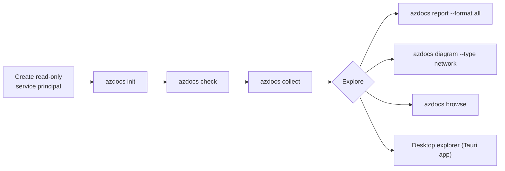

# Usage

The five-minute path from nothing to a documented estate:

1. [Install](installation.md) the binary
2. [Configure](configuration.md) a read-only service principal
3. [Collect](collecting.md) a snapshot
4. Explore in the [desktop app](desktop.md), export [reports](reports.md) and
   [diagrams](diagrams.md), or [browse](tui.md) interactively
5. [Diff snapshots](snapshots.md) over time, extend the [query pack](queries.md), wire it into [CI](ci.md)

Capture [website screenshots](website-screenshots.md) from the desktop and include them in offline exports.

Stuck? See [troubleshooting](troubleshooting.md).

See [permission diagnostics](permissions.md) for connection tests and the limits of read-only RBAC evidence.
