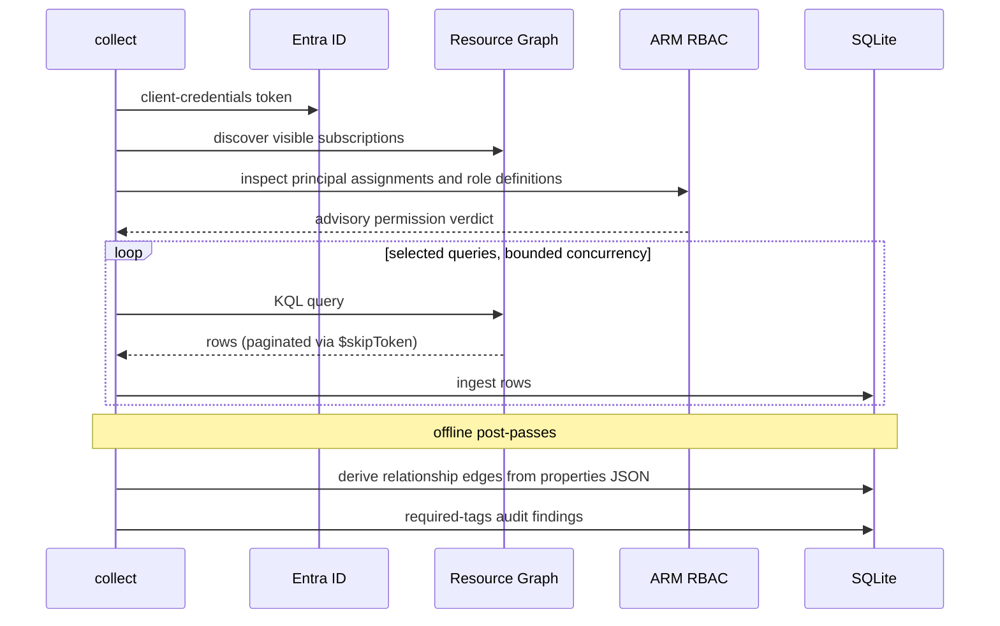

# Collecting a snapshot

```sh
azdocs collect
```

Runs the selected query pack, including user overrides, and stores the results
as a new snapshot. With no filters, every loaded query runs; see the
[query reference](../reference/queries.md) for the built-in catalogue:



Choose a configured profile with `--tenant <reference>`. Collection performs the shared
[permission preflight](permissions.md) before live execution. Authentication
failures stop collection; broader-grant or incomplete-coverage warnings are
advisory. Each snapshot belongs to the selected tenant in the shared database.

Desktop collection then discovers website endpoints, supplements Front Door
evidence through ARM, and captures website screenshots. This stage has separate
progress and outcomes; the CLI does not capture websites. See
[Website screenshots](website-screenshots.md).

## Scoping and tuning

```sh
azdocs collect --subscriptions <id>,<id>       # specific subscriptions
azdocs collect --categories networking,security
azdocs collect --queries all_resources         # only named queries
azdocs collect --skip-queries orphaned_resources
azdocs collect --concurrency 2                 # gentler on ARG quota
azdocs collect --notes "pre-migration baseline"
```

Filters apply to the query pack; they do not automatically add dependency
queries. For example, omitting `all_resources` leaves the typed resource inventory
empty and limits derived relationships, required-tag checks and resource views.
Omitting `subscriptions` or `resource_groups` also reduces stored scope metadata.
For a full estate report, collect the complete pack.

## Snapshot status

| Status | Meaning |
|---|---|
| `complete` | Every query succeeded |
| `partial` | Some queries failed; the rest of the data is usable |
| `failed` | Everything failed |

Per-query results (row counts, durations, errors) are recorded — inspect with
`azdocs snapshots show <id>`.

## Throttling

Resource Graph allows short bursts, then throttles. azdocs paces itself from
the quota headers ARG returns and honours `Retry-After` on 429s, so
`ARG throttled (429); backing off` warnings during collect are normal — the
throttled query fails if it exhausts its retries. Other query errors can also
produce a partial snapshot; if every selected query fails, the snapshot is failed.

Next: [Reports](reports.md)
