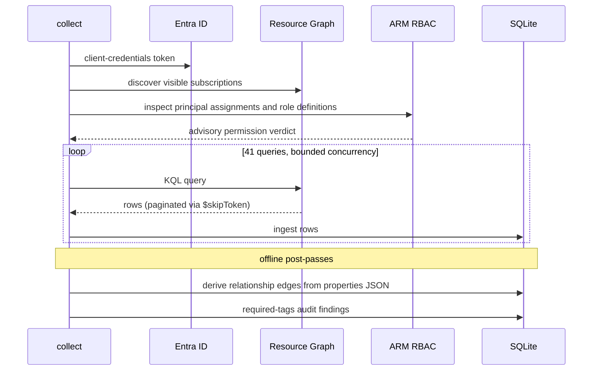

# Collecting a snapshot

```sh
azdocs collect
```

Runs the full query pack (41 queries — see the
[query reference](../reference/queries.md)) and stores the results as a new
snapshot:



Choose a profile with `--tenant acme`. Collection performs the shared
[permission preflight](permissions.md) before live execution. Authentication
failures stop collection; broader-grant or incomplete-coverage warnings are
advisory. Each snapshot belongs to the selected tenant in the shared database.

## Scoping and tuning

```sh
azdocs collect --subscriptions <id>,<id>       # specific subscriptions
azdocs collect --categories networking,security
azdocs collect --queries all_resources         # only named queries
azdocs collect --skip-queries orphaned_resources
azdocs collect --concurrency 2                 # gentler on ARG quota
azdocs collect --notes "pre-migration baseline"
```

## Snapshot status

| Status | Meaning |
|---|---|
| `complete` | Every query succeeded |
| `partial` | Some queries failed; the rest of the data is usable |
| `failed` | Everything failed |

Per-query results (row counts, durations, errors) are recorded — inspect with
`azdocs snapshots show <id>`.

## Throttling

Resource Graph allows short bursts, then throttles. azdocs paces itself from
the quota headers ARG returns and honours `Retry-After` on 429s, so
`ARG throttled (429); backing off` warnings during collect are normal — the
run only degrades to `partial` if a query exhausts all retries.

Next: [Reports](reports.md)
