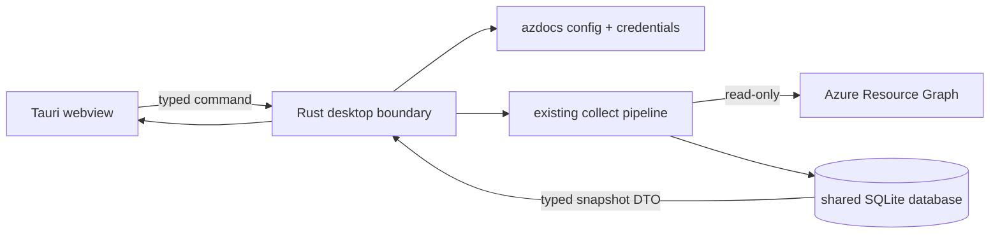

# Desktop explorer

The Tauri desktop app explores the same SQLite snapshots as the CLI and TUI.
Its relationship view is an interactive Cytoscape.js canvas whose graphs are
built by the Rust side (`topology_graph`) with one non-negotiable rule:
**every resource in scope is represented** — drawn as its own node, folded
into its host (NICs and disks into their VM, child resources into their ARM
parent), or aggregated into a ×N tile — and the status chip states the exact
arithmetic. Nothing is silently truncated. Resource nodes are draggable, the
canvas supports pan and zoom, links are boundary-anchored and orthogonal, and
directional flow motion is optional.
Every resource uses the vendored Microsoft Azure service icon resolved for its
ARM type.
It does not maintain a second inventory and it does not query Azure while you
browse: resource details, findings, relationships, history, and comparisons
all come from the selected local snapshot.

## Run from a source checkout

Node.js, Rust, and the [Tauri v2 platform prerequisites](https://v2.tauri.app/start/prerequisites/)
for your operating system are required.

```sh
cd desktop
npm install
npm run tauri dev
```

Build web assets without opening a native window:

```sh
cd desktop
npm run build
```

Create a platform installer or application bundle:

```sh
cd desktop
npm run tauri build
```

## What you can explore

- **Estate** keeps the subscription/resource-group hierarchy, searchable
  resource ledger, and resource inspector visible together. Filter by scope,
  type, location, resource name, ARM type, group, or tags.
- **Relationships** is a full-bleed, hierarchical graph workspace. Its initial
  camera fits the readable connected core; **Fit all** is the first control in
  the icon ribbon when you need the complete overview. The **estate map** lays expanded
  subscriptions out as responsive resource-group grids and keeps collapsed
  subscriptions as compact, individually toggleable lanes. Click or press
  Enter on a group to open its group map immediately.
  A group map places contained and connected resources first, neighbours from
  other groups on boundary rails, and resources without drawn relationships in
  a lower secondary region outside the default camera. VNet → subnet
  containment remains framed, NICs/disks remain folded into their VM, child
  resources remain folded into their parent, and fan-outs remain represented
  by ×N tiles. The **neighbourhood** mode is available only after a resource is
  explicitly selected: that resource is centred, inbound relationships are on
  the left, outbound relationships on the right, and second-hop nodes occupy
  deterministic outer columns.

  Zoom is semantic: full labels at readable scale, primary labels at the
  middle rung, then icon/count overview tiles. Text is never rendered below
  11px and relationship labels appear only on the selected path. The camera
  adapts its fit to the graph level and available viewport: sparse group and
  neighbourhood maps may zoom above 1:1, while Fit all remains an overview.
  Scope changes and drill actions use Cytoscape's native viewport animation
  and become instant when reduced motion is active. Click or press Enter on a
  resource to open its resource record. Use the labelled relationship-count
  action on the card, or press **R** while the card has keyboard focus, to open
  its neighbourhood directly. The record repeats this as **Explore N
  relationships**. Back returns through the exact group, record, and
  neighbourhood history, while the breadcrumb moves directly through the
  estate/group/resource hierarchy. Aggregate tiles expand in place to expose
  their members. Spatial arrow keys move between graph
  items. The joined icon ribbon exposes Fit all, zoom, selected-path motion,
  subscription-lane reset, and help with visible tooltips and accessible names.
  The slim bottom rail reports
  **source relationships** separately from rendered **connectors** and carries
  the relationship-kind legend/filter. Anything hidden by a filter remains
  counted. If a topology request fails, the last successful graph is retained
  and identified as stale with Retry and Revert controls. Relationships remain
  Rust post-pass edges already stored in SQLite; opening this view does not add
  API calls.
- **Findings** orders stored audit evidence by severity and links every
  resource-scoped result back to its resource properties.
- **Snapshots** shows collection history, query health, and added, changed, or
  removed resource IDs compared with the preceding snapshot.

The global search shortcut is `Cmd+K` on macOS or `Ctrl+K` on Windows and
Linux. Every resource pane and navigation action is keyboard reachable.

## Data and credentials

The app initially uses `storage.db_path` from the normal azdocs configuration.
**Open data** can switch to another existing `.db`, `.sqlite`, or `.sqlite3`
file for the current session. The chosen database is opened by Rust; the
webview never receives a file-system permission.

**Collect snapshot** invokes the existing client-credentials and Azure
Resource Graph pipeline. Credentials remain in the config/environment on the
Rust side and are never sent through Tauri IPC. If credentials are not fully
configured, the button is disabled and its tooltip points at the resolved
configuration path.

The collector is the only networked path:



All other desktop commands open the selected database for one request and
return serialisable snapshot data. The SQLite connection is not shared across
webview commands.

## Browser preview

`npm run dev` opens the web interface without Tauri. In that mode the app uses
the canonical fixture-shaped illustrative estate and labels the toolbar
**Illustrative workspace**. This is for responsive and visual development;
only a Tauri window reads real databases or collects Azure data.

Next: [Snapshots](snapshots.md)
