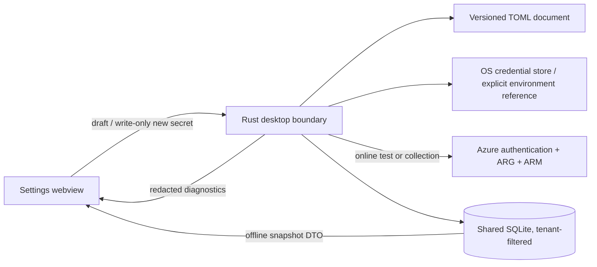

# Desktop explorer

The Tauri desktop app explores the same SQLite snapshots as the CLI and TUI.
Its relationship view is an interactive Cytoscape.js canvas whose graphs are
built by the Rust side (`topology_graph`) with one non-negotiable rule:
**every resource in scope is represented** — drawn as its own node, folded
into its host (NICs and disks into their VM, child resources into their ARM
parent), or aggregated into a ×N tile — and the status chip states the exact
arithmetic. Nothing is silently truncated. Resource nodes are draggable, the
canvas supports pan and zoom, and directional flow motion is optional. Each
link receives its own invisible source and target boundary ports: shared
endpoints fan into stable, spatially ordered taxi channels instead of sharing
one trunk. Relationship names are DOM label plates above the canvas, so no
connector can paint over their text.
Every resource uses the vendored Microsoft Azure service icon resolved for its
ARM type.
It does not maintain a second inventory and it does not query Azure while you
browse: resource details, findings, relationships, history, and comparisons
all come from the selected local snapshot.

Website endpoints also have [saved screenshots](website-screenshots.md), captured automatically after desktop collection or on request. Browsing saved images stays offline.

## Install a release

On Apple Silicon macOS:

```sh
brew install --cask russmckendrick/tap/azdocs-desktop
```

The same signed and notarized DMG, plus Windows x86-64 and Linux x86-64/ARM64
packages, are available from
[GitHub Releases](https://github.com/russmckendrick/azdocs/releases). The
[installation guide](installation.md#github-releases) gives GitHub CLI download,
checksum verification and platform installation commands.

## Run from a source checkout

Node.js 22.12+ (22.x), pnpm 10, current stable Rust, and the [Tauri v2 platform prerequisites](https://v2.tauri.app/start/prerequisites/)
for your operating system are required.

```sh
cd desktop
pnpm install --frozen-lockfile
pnpm run tauri dev
```

From the same `desktop/` directory, build web assets without opening a native window:

```sh
pnpm run build
```

Create a platform installer or application bundle:

```sh
pnpm run tauri build
```

## What you can explore

- **Estate** keeps the subscription/resource-group hierarchy, searchable
  resource ledger, and resource inspector visible together. Filter by scope,
  type, location, resource name, ARM type, group, or tags.
- **Map** is a full-bleed, hierarchical graph workspace. Its initial
  camera fits the readable connected core; **Fit all** is the first control in
  the icon ribbon when you need the complete overview. The **estate** level
  opens with every subscription collapsed to a bar in a strip across the
  top; expand one and it is laid out below as a full-width grid of the
  resource groups that have cross-group relationships. Groups nothing crosses
  into share one **Unconnected groups ×N** tile per subscription, so the
  connectors are the picture rather than a wall of boxes; the tile expands in
  place to list its groups, and the **Unconnected** toggle hides it (the
  hidden count stays on the status rail). Click or press Enter on a group to
  open its group map immediately.
  A group map places contained and connected resources first, neighbours from
  other groups on boundary rails, and resources without drawn relationships in
  a lower secondary region outside the default camera. VNet → subnet
  containment remains framed, NICs/disks remain folded into their VM, child
  resources remain folded into their parent, and fan-outs remain represented
  by ×N tiles. The **neighbourhood** mode is available only after a resource is
  explicitly selected: that resource is centred, inbound relationships are on
  the left, outbound relationships on the right, and second-hop nodes occupy
  deterministic outer columns.

  Zoom is semantic: full labels at readable scale, primary labels at the
  middle rung, then icon/count overview tiles. Text is never rendered below
  11px and relationship labels appear only on the active traced path. Keyboard
  focus wins over pointer hover, which wins over the selected neighbourhood
  subject; unrelated routes fade without disappearing. Each active label sits
  beside the remote endpoint on an opaque plate and moves with pan, zoom,
  drag, resize, and camera animation. The camera
  adapts its fit to the graph level and available viewport: sparse group and
  neighbourhood maps may zoom above 1:1, while Fit all remains an overview.
  Scope changes and drill actions use Cytoscape's native viewport animation
  and become instant when reduced motion is active. Click or press Enter on a
  resource to open its resource record. Use the labelled relationship-count
  action on the card, or press **R** while the card has keyboard focus, to open
  its neighbourhood directly. The record repeats this as **Explore N
  relationships**. Back returns through the exact group, record, and
  neighbourhood history, while the trail in the title bar — Map ›
  subscription › group › resource, ending in the current page's own name —
  moves directly through the hierarchy: the subscription crumb returns to
  the map with that subscription expanded, and the group crumb opens its
  group map. Aggregate tiles expand in place to expose
  their members. Spatial arrow keys move between graph
  items. The joined icon ribbon exposes Fit all, zoom, selected-path motion,
  subscription-lane reset, and help with visible tooltips and accessible names.
  The slim bottom rail reports how many groups or resources are drawn
  and where the rest went (collapsed subscriptions, unconnected tiles, folded
  hosts, filters), then how many **relationships** are drawn as how many
  **connectors** — the two differ because parallel relationships between the
  same pair share one connector — and carries the relationship-kind
  legend/filter. Anything hidden by a filter remains counted. If a topology request fails, the last successful graph is retained
  and identified as stale with Retry and Revert controls. Relationships remain
  Rust post-pass edges already stored in SQLite; opening this view does not add
  API calls.
- **Findings** orders stored audit evidence by severity and links every
  resource-scoped result back to its resource properties.
- **Snapshots** shows collection history, query health, and added, changed, or
  removed resource IDs compared with the preceding snapshot.
- **Exports** generates four outcome-led artifacts from the active snapshot,
  optionally scoped to one subscription, one resource group or findings at a
  severity or above:
  the print-ready PDF Field Report, an editable Word Report, the Excel Data
  Workbook, or the Draw.io Diagram Workbook. The app deliberately omits format
  matrices and theme choice; HTML, CSV, Markdown, scoped diagrams, Mermaid,
  SVG and PNG remain available to CLI and automation users.

The global search shortcut is `Cmd+K` on macOS or `Ctrl+K` on Windows and
Linux. Every resource pane and navigation action is keyboard reachable.

## Settings

Settings stays available before the first collection and with missing or invalid
configuration. To start, add a tenant, enter its directory and application IDs,
choose a secret source, test the connection and save. **Collect snapshot** then
collects the active tenant. Invalid fields and failures appear inside Settings;
parse errors omit source lines that could contain secrets.

- **Tenants:** search profiles, add or rename one, choose the CLI default, or
  remove its profile while retaining history. **Connection** groups identity
  and credentials; **Collection & audit** edits subscription scope, concurrency
  and required tags; **Report branding** edits report identity, colours and
  paths. Typography and document geometry expand under advanced settings.
- **Shared defaults:** edit collection, audit and branding values inherited by
  tenants. Tenant fields show **Inherited** or **Overridden**. Clear an override
  to reset it; an explicit empty list replaces the shared list.
- **Application:** choose System/Light/Dark appearance, edit the shared database
  path, load or reload the active config and export redacted diagnostics.

The form scrolls inside the workspace. **Save changes / Discard changes** stays
visible beneath it, including in smaller windows. Unsaved configuration blocks
estate switching and closing the window; save or discard before leaving. Theme
preference is immediate and local. Changing a profile in the editor does not
switch the active estate.

**Test connection** uses the current draft without saving it. It opens a modal with
authentication, visible and inaccessible subscriptions, RBAC permission
warnings and check time. Close with Escape or **Close connection test**; the
form retains a compact status and **View test results** reopens the details.
Editing the draft invalidates the result. A submitted
password field is cleared; after a successful draft test, Rust can hold the new
secret temporarily behind an opaque token for up to 15 minutes so Save does not
require re-entry. Discarding, leaving Settings or switching identity clears it.
Stored secrets are never displayed. See [Permission diagnostics](permissions.md).

## Data, tenant context and credentials

The app remembers the selected configuration and tenant locally. The toolbar's
**Tenant** selector resets search, navigation and snapshot selection. History,
latest selection and comparisons stay inside that tenant. Tenants whose profile
was removed remain browsable by ID. No history is deleted by profile edits.

`storage.db_path` selects the shared database. **Open data** or **Application →
Open another…** opens an existing database for the session. Saving a new path
checks and opens that location; an unusable database leaves the previous
configuration intact. Relative paths resolve beside the config file. Files are
not moved. Rust owns database and file access; the webview has no general
filesystem permission.

**Export redacted diagnostics** includes the config path and revision, editable
values, active tenant, database path and the latest applicable collection
permission check. It also works with a missing or invalid config, recording a
sanitised error instead of the file contents. External config edits invalidate
the saved check. Draft connection-test results belong only to that draft.

New client secret entry is write-only from the webview into Rust. Existing
secrets, OAuth tokens and credential-store reads never cross back to the
frontend. Native storage uses Keychain, Windows Credential Manager or Secret
Service; headless profiles may explicitly name an environment variable. Store
errors do not fall back to plaintext. See [Configuration](configuration.md).



Collection and website capture lock context switching and capture immutable
config, tenant and database context when they start. Export captures its own
context and remains offline. Late frontend responses are ignored after a
snapshot or tenant switch. Settings tests and live preflight are read-only
network paths; browsing stored evidence and downstream reporting are offline.

## Offline exports

Report progress names the file currently being generated, including the optional
`technical-reference.pdf` or `.docx` companion. The assessment is written first,
so its presence does not mean the reference has finished. Exports write only
the selected deliverables; query provenance stays in the snapshot database.

The **Exports** workspace uses a native directory picker; the selected path is
sent to Rust only for the duration of the export. The webview receives progress
and a sorted manifest of completed files, but it never receives general file
system access. Existing configuration still supplies report branding, custom
themes, logos, fonts and labels. The app's own wording comes from the same
`[branding] labels` set, resolved for the active tenant — see
[reference/labels.md](../reference/labels.md).

Reports compose shared diagram assets once even when several report formats
are selected. The desktop diagram deliverable is the editable `.drawio`
workbook. CLI users can additionally request per-VNet/per-group diagrams and
SVG/PNG files per workbook sheet. Every export reads only the selected SQLite snapshot and does not
contact Azure.

## Browser preview

`pnpm run dev` starts the web development server without Tauri. Open the local
URL printed by Vite (normally `http://127.0.0.1:1420`) in a browser. In that mode the app uses
the canonical fixture-shaped illustrative estate and labels the toolbar
**Illustrative workspace**. This is for responsive and visual development;
only a Tauri window reads real databases or collects Azure data. Settings uses
illustrative profiles and mock connection results in browser preview; credential
entry and native file pickers are unavailable.

Next: [Snapshots](snapshots.md)
