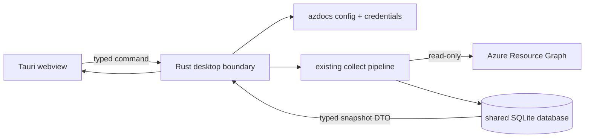

# Desktop explorer

The Tauri desktop app explores the same SQLite snapshots as the CLI and TUI.
Its relationship view is an interactive Cytoscape.js canvas that starts with
resource groups, drills into one group's resources, and provides a one-hop
resource neighbourhood. Resource nodes are draggable, the canvas supports pan
and zoom, links are boundary-anchored and orthogonal, and directional flow
motion is optional.
Every resource uses the vendored Microsoft Azure service icon resolved for its
ARM type.
It does not maintain a second inventory and it does not query Azure while you
browse: resource details, findings, relationships, history, and comparisons
all come from the selected local snapshot.

## Run from a source checkout

Node.js, Rust, and the [Tauri v2 platform prerequisites](https://v2.tauri.app/start/prerequisites/)
for your operating system are required.

```sh
cd desktop
npm install
npm run tauri dev
```

Build web assets without opening a native window:

```sh
cd desktop
npm run build
```

Create a platform installer or application bundle:

```sh
cd desktop
npm run tauri build
```

## What you can explore

- **Estate** keeps the subscription/resource-group hierarchy, searchable
  resource ledger, and resource inspector visible together. Filter by scope,
  type, location, resource name, ARM type, group, or tags.
- **Relationships** starts with every resource group as an aggregate containing
  resource, finding, type, and cross-group connection counts. Select a group to
  inspect it, then open it to render the contained resources and internal
  links. The selected resource's one-hop neighbourhood can cross group
  boundaries. Relationships are the Rust post-pass edges already stored in
  SQLite; opening this view does not add API calls.
- **Findings** orders stored audit evidence by severity and links every
  resource-scoped result back to its resource properties.
- **Snapshots** shows collection history, query health, and added, changed, or
  removed resource IDs compared with the preceding snapshot.

The global search shortcut is `Cmd+K` on macOS or `Ctrl+K` on Windows and
Linux. Every resource pane and navigation action is keyboard reachable.

## Data and credentials

The app initially uses `storage.db_path` from the normal azdocs configuration.
**Open data** can switch to another existing `.db`, `.sqlite`, or `.sqlite3`
file for the current session. The chosen database is opened by Rust; the
webview never receives a file-system permission.

**Collect snapshot** invokes the existing client-credentials and Azure
Resource Graph pipeline. Credentials remain in the config/environment on the
Rust side and are never sent through Tauri IPC. If credentials are not fully
configured, the button is disabled and its tooltip points at the resolved
configuration path.

The collector is the only networked path:



All other desktop commands open the selected database for one request and
return serialisable snapshot data. The SQLite connection is not shared across
webview commands.

## Browser preview

`npm run dev` opens the web interface without Tauri. In that mode the app uses
the canonical fixture-shaped illustrative estate and labels the toolbar
**Illustrative workspace**. This is for responsive and visual development;
only a Tauri window reads real databases or collects Azure data.

Next: [Snapshots](snapshots.md)
