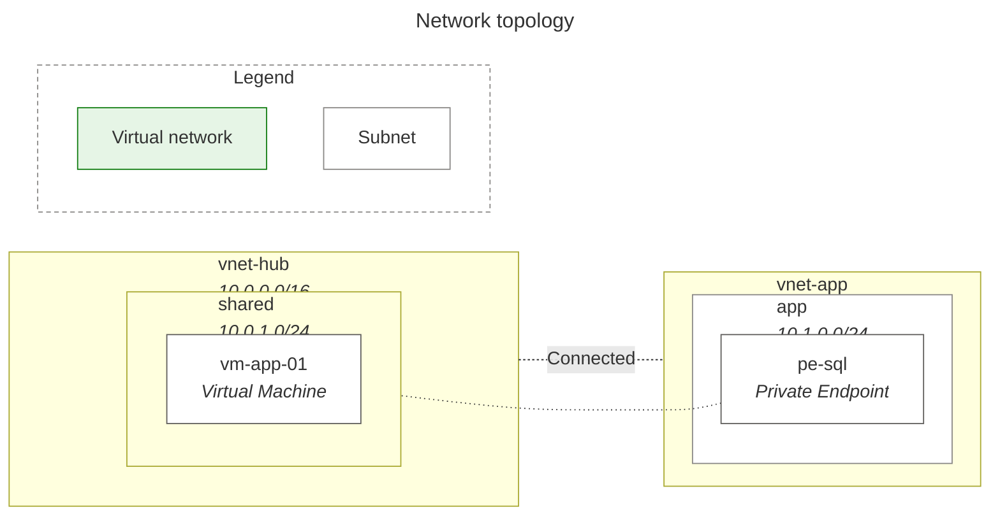

# Diagrams

```text
azdocs diagram --type hierarchy|resources|network|vnets|resource-groups|workbook \
    [--format drawio|mermaid|both|svg|png|all] \
    [--subscription <id>] [--resource-group <name>] [--out <path>]
```

| Type | Shows |
|---|---|
| `hierarchy` | Tenant → subscriptions → resource groups with resource counts |
| `resources` | Resource-group containers, an icon per resource, attachment edges |
| `network` | VNets/subnets as containers, VMs placed in their subnets, dashed peering edges, NSG associations, private-endpoint links |
| `vnets` | One diagram per VNet: its subnets and resources, plus dashed stubs to peered VNets |
| `resource-groups` | One diagram per resource group: VNet subtrees homed there plus a "Not in a virtual network" zone |
| `workbook` | A single multi-sheet `.drawio` file: network topology, VNet peerings, every per-VNet and per-RG sheet, then a **Regions** sheet with the resource-locations map |

Diagrams exported here are drawn at **full detail** — every resource gets its
own icon and name, using a natural 1400px working width. The same graphs
embedded in a report are **summarised** instead: resources aggregated by type
(`Storage Account ×13`) at a fixed A4 text-column width. Height follows the
content within the page budget; the page-fraction label describes that height
rather than adding padding to reach a fixed fraction. See
[Diagram standards](../reference/diagrams.md) for the full contract.

`hierarchy`, `resources`, and `network` write one file
(`output/azdocs-<type>.<ext>`). The fan-out types write one file per scope
under `output/diagrams/vnets/` and `output/diagrams/resource-groups/`
(`--out` names the directory instead). The workbook writes
`output/azdocs-workbook.drawio` — or, for `svg`/`png`, one file per sheet under
`output/diagrams/workbook/`, since a raster cannot hold multiple sheets.

The Regions sheet is the full-colour world map from the PDF and Word reports,
drawn in the configured theme's `[palette.map]` colours but showing the whole
globe rather than the print crop. Each marker has an editable label pill
(`UK South · 255`) beside it: right, left, above or below, or further out with
a leader line when neighbours crowd it, so labels never cover each other or a
marker. Locations with no place on the map, such as `global`, are listed in
one caption under it. The sheet is omitted when no resource has a placeable
region; `svg`/`png` write the map alone as `regions.svg` or `regions.png`.

The desktop's Draw.io Diagram Workbook uses the same workbook output name under
the directory you choose. Other diagram types and image formats are available
through the CLI.

A `network` diagram is shaped like this (actual azdocs Mermaid output — GitHub
renders it natively; node ids are positional, containers nest as subgraphs, and
a legend subgraph names the boundaries the picture uses):



Peering edges keep their state as the edge label; association edges (private
links, NSG placement) use a finer dot than dashed peerings.

Use `--tenant <reference-or-tenant-id>` to select the estate. Explicit snapshot
IDs remain usable offline without credentials; a supplied tenant selection
enforces ownership. See [tenant history](snapshots.md#tenant-isolation).

## Formats

- **`.drawio`** — editable in [draw.io](https://app.diagrams.net) or the
  VS Code draw.io extension. Uses the azure2 icon set, swimlane containers,
  and orthogonal boundary-anchored connectors. This is the workbook format
  that keeps all sheets in one editable file. SVG/PNG workbook exports write
  a separate image per sheet.
- **`.mmd`** — Mermaid text. Paste into any GitHub markdown file, wiki, or
  docs site and it renders. Not available for `workbook` — use `vnets` /
  `resource-groups` for per-scope Mermaid.
- **`.svg`** — standalone vector render (shared layout with drawio). Also
  embedded in the HTML docs site (`output/docs-html/diagrams/`).
- **`.png`** — the SVG rasterised at 2× via resvg; needs no browser or
  external tool. SVG/PNG diagrams use the Microsoft Azure icon set embedded
  in the binary (mapping in `data/icon_mapping.toml`; unmapped types get
  the generic resource icon).

## Scoping

Estate-wide diagrams stop being useful past a certain size — over ~150 nodes
azdocs warns and suggests narrowing:

```sh
azdocs diagram --type network --subscription <id>
azdocs diagram --type resources --subscription <id> --resource-group rg-app
azdocs diagram --type vnets --format png            # one PNG per VNet
azdocs diagram --type workbook                      # everything, one drawio file
```

Next: [The TUI](tui.md)
