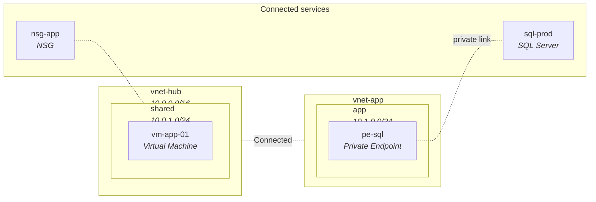

# Diagrams

```sh
azdocs diagram --type hierarchy|resources|network \
    [--format drawio|mermaid|both] [--subscription <id>] [--resource-group <name>] [--out <path>]
```

| Type | Shows |
|---|---|
| `hierarchy` | Tenant → subscriptions → resource groups with resource counts |
| `resources` | Resource-group containers, an icon per resource, attachment edges |
| `network` | VNets/subnets as containers, VMs placed in their subnets, dashed peering edges, NSG associations, private-endpoint links |

A `network` diagram is shaped like this (this is actual azdocs Mermaid output
style — GitHub renders it natively):



## Formats

- **`.drawio`** — editable in [draw.io](https://app.diagrams.net) or the
  VS Code draw.io extension. Uses the azure2 icon set, swimlane containers,
  and automatic edge routing.
- **`.mmd`** — Mermaid text. Paste into any GitHub markdown file, wiki, or
  docs site and it renders.

## Scoping

Estate-wide diagrams stop being useful past a certain size — over ~150 nodes
azdocs warns and suggests narrowing:

```sh
azdocs diagram --type network --subscription <id>
azdocs diagram --type resources --subscription <id> --resource-group rg-app
```

Next: [The TUI](tui.md)
