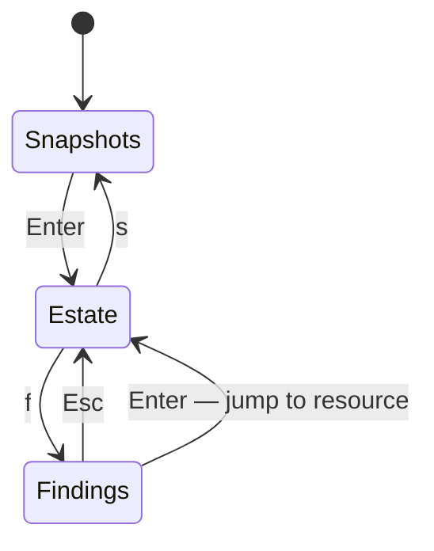

# The TUI

```text
azdocs browse [--snapshot <id|latest>]
```

An interactive terminal browser over a stored snapshot.



- **Snapshots** — pick which snapshot to explore; the list names each
  snapshot's tenant, and a snapshot that will not open says why in the footer
  instead of opening empty
- **Estate** — three panes: subscription/resource-group tree, filterable
  resource list, and a detail pane with tags, related edges, and the full
  pretty-printed properties JSON. In the detail pane `n`/`p` move through the
  related resources and `Enter` follows the highlighted one.
- **Findings** — severity-ordered; `Tab` cycles the severity floor (all →
  high → medium → low), `Enter` jumps to the affected resource
- `?` shows every key on any screen

Use `--tenant <reference-or-tenant-id>` to select the estate. Explicit snapshot
IDs remain usable offline without credentials; a supplied tenant selection
enforces ownership. See [tenant history](snapshots.md#tenant-isolation).

## Keys

| Key | Action |
|---|---|
| `↑↓` / `jk` | Move |
| `Tab` | Cycle panes (Estate) / severity floor (Findings) |
| `Enter` | Drill in / open / follow the highlighted relationship |
| `n` / `p` | Next / previous related resource (detail pane) |
| `/` | Incremental filter (name, type, tags) |
| `f` | Findings screen |
| `s` | Snapshot picker |
| `?` | Keys overlay |
| `Esc` | Back / clear / close the overlay |
| `q` | Quit |

Next: [Snapshots](snapshots.md)
