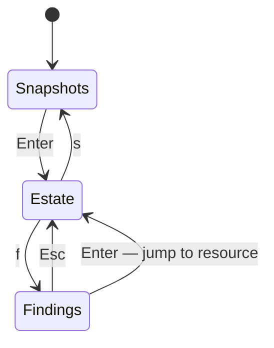

# The TUI

```sh
azdocs browse [--snapshot <id|latest>]
```

An interactive terminal browser over a stored snapshot.



- **Snapshots** — pick which snapshot to explore
- **Estate** — three panes: subscription/resource-group tree, filterable
  resource list, and a detail pane with tags, related edges, and the full
  pretty-printed properties JSON
- **Findings** — severity-ordered; `Enter` jumps to the affected resource

Use `--tenant <reference-or-tenant-id>` to select the estate. Explicit snapshot
IDs remain usable offline without credentials; a supplied tenant selection
enforces ownership. See [tenant history](snapshots.md#tenant-isolation).

## Keys

| Key | Action |
|---|---|
| `↑↓` / `jk` | Move |
| `Tab` | Cycle panes |
| `Enter` | Drill in / open |
| `/` | Incremental filter (name, type, tags) |
| `f` | Findings screen |
| `s` | Snapshot picker |
| `Esc` | Back / clear |
| `q` | Quit |

Next: [Snapshots](snapshots.md)
